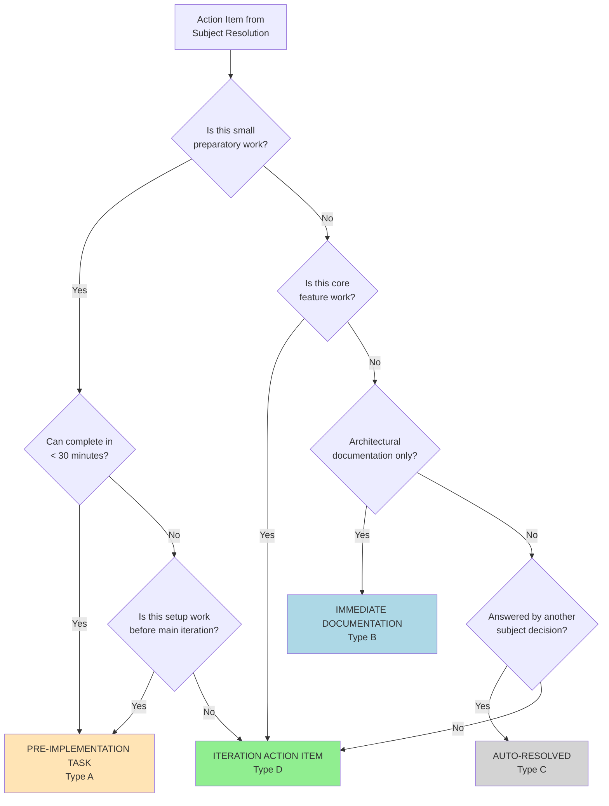
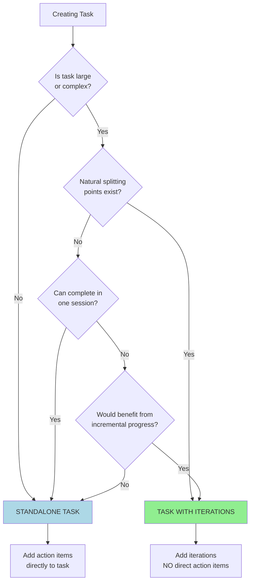
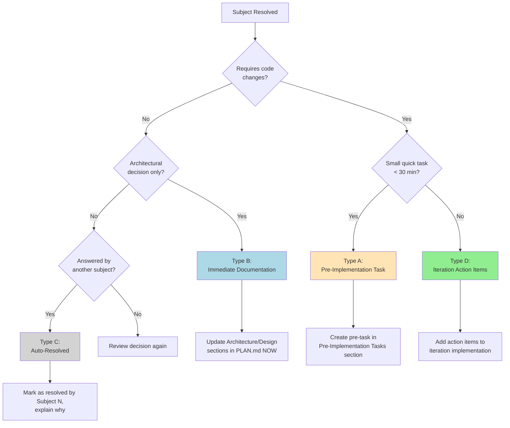
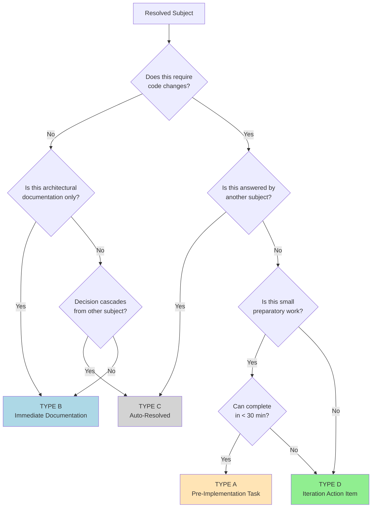

**Version**: 1.1.0

---

<!-- AI_SCAN:QUICK_REFERENCE:5-353 -->
# Quick Reference for AI (Read This First!)

> **Purpose**: This section provides essential Flow framework knowledge in ~300 lines (~15k tokens) instead of reading the entire 3897-line file (~200k tokens). Read this first, then use the Section Index to jump to specific sections only when needed.

---

<!-- AI_SCAN:CORE_HIERARCHY:12-28 -->
## Core Hierarchy

```
PHASE → TASK → ITERATION → BRAINSTORM → IMPLEMENTATION → COMPLETE
```

**Structure**:
- **PHASE**: High-level milestone (e.g., "Core Implementation", "Testing")
- **TASK**: Feature/component to build (e.g., "Database Schema", "API Endpoints")
- **ITERATION**: Incremental buildout (e.g., "V1: Basic validation", "V2: Advanced rules")
- **BRAINSTORM**: Design before code (subjects → decisions → action items)
- **IMPLEMENTATION**: Execute action items from brainstorming

**Golden Rule**: Brainstorm → Pre-Tasks → Implementation (never skip brainstorming for complex work)

---

<!-- AI_SCAN:STATUS_MARKERS_QUICK:30-48 -->
## Status Markers

| Marker | Meaning | When to Use |
|--------|---------|-------------|
| ✅ | COMPLETE | Finished and verified (frozen, skip re-verification) |
| ⏳ | PENDING | Not started yet |
| 🚧 | IN PROGRESS | Currently working on this |
| 🎨 | READY | Brainstorming done, ready to implement |
| ❌ | CANCELLED | Decided against (must document WHY) |
| 🔮 | DEFERRED | Moved to V2/V3/later (must document WHY + WHERE) |
| 🎯 | ACTIVE | Current focus (optional, used in some contexts) |

**Rules**:
- Every Phase/Task/Iteration/Subject MUST have a status marker
- ✅ COMPLETE items are verified & frozen (skip re-verification)
- ❌ CANCELLED and 🔮 DEFERRED must document reason

---

<!-- AI_SCAN:TASK_STRUCTURE_QUICK:50-108 -->
## Task Structure Rules

**The Golden Rule**: Tasks must be **EITHER** Standalone **OR** have Iterations - **NEVER BOTH**

### Pattern 1: Standalone Task (Direct Action Items)

```markdown
#### Task 5: Update Documentation ⏳

**Action Items**:
- [ ] Update README.md
- [ ] Fix typos in guide
- [ ] Add examples
```

**When to Use**:
- Straightforward work (5-10 simple steps)
- No design decisions needed
- Can complete in one session
- Single focus

### Pattern 2: Task with Iterations (NO Direct Action Items)

```markdown
#### Task 7: Implement Payment Gateway 🚧

**Purpose**: Integrate Stripe API for payment processing

---

##### Iteration 1: API Setup ⏳

**Goal**: Configure Stripe SDK and credentials

[Brainstorming → Implementation]

---

##### Iteration 2: Payment Processing 🚧

**Goal**: Implement charge creation and webhooks

[Currently implementing...]
```

**When to Use**:
- Large/complex task
- Needs design decisions (brainstorming required)
- Multiple stages (V1 → V2 → V3)
- Want incremental shipping

**NEVER**:
- ❌ Task with BOTH action items AND iterations (creates confusion about completion criteria)

**Exception**:
- ✅ Pre-implementation tasks (from brainstorming) are allowed
- Pre-tasks completed BEFORE iterations start
- Structure: Task → Iteration → Brainstorming → Pre-tasks → Implementation

---

<!-- AI_SCAN:SUBJECT_RESOLUTION:112-129 -->
## Subject Resolution Types

When brainstorming, every resolved subject falls into ONE of these types:

| Type | Name | When | Action | Example |
|------|------|------|--------|---------|
| **A** | Pre-Implementation Task | Small code changes needed BEFORE iteration | Create pre-task (< 30 min work) | Fix interface, rename file, update enum |
| **B** | Immediate Documentation | Architectural decision, no code yet | Update Architecture section NOW | Design pattern choice, API contract |
| **C** | Auto-Resolved | Answered by another subject's decision | Mark as resolved by Subject N | Cascade decisions |
| **D** | Iteration Action Items | Substantial feature work that IS the iteration | Action items become iteration implementation | Build API endpoint, implement validator |

**Decision Flow**:
1. Does subject require code changes?
   - **NO** → Type B (Documentation) or Type C (Auto-resolved)
   - **YES** → Continue to #2
2. Is it small quick task (< 30 min)?
   - **YES** → Type A (Pre-task)
   - **NO** → Type D (Iteration work)

---

<!-- AI_SCAN:COMMON_PATTERNS:134-207 -->
## Common Patterns Quick Reference

### Brainstorming Pattern

```markdown
### **Brainstorming Session - [Topic]**

**Subjects to Discuss**:
1. ⏳ Subject 1
2. ⏳ Subject 2

**Resolved Subjects**:

---

### ✅ Subject 1: [Name]

**Decision**: [Your decision]

**Resolution Type**: A / B / C / D

**Action Items** (if Type A or D):
- [ ] Action item 1
- [ ] Action item 2
```

**Workflow**:
1. `/flow-brainstorm-start` - Create session
2. `/flow-next-subject` - Resolve each subject (choose Type A/B/C/D)
3. `/flow-brainstorm-review` - Review the subject resolutions - AI suggests followup work
4. `/flow-brainstorm-complete` - Mark ready for implementation
5. `/flow-implement-start` - Begin coding

### Pre-Implementation Tasks Pattern

```markdown
### **Pre-Implementation Tasks:**

#### ⏳ Task 1: [Name] (PENDING)

**Objective**: [What this accomplishes]

**Action Items**:
- [ ] Item 1
- [ ] Item 2

**Files to Modify**:
- path/to/file.ts (what to change)
```

**When to Use**:
- Small preparatory work discovered during brainstorming
- Must be completed BEFORE `/flow-brainstorm-complete`
- Examples: Interface changes, file renames, bug fixes

### Implementation Pattern

```markdown
### **Implementation - Iteration [N]: [Name]**

**Status**: 🚧 IN PROGRESS

**Action Items**:
- [x] Completed item
- [ ] Pending item

**Implementation Notes**:
[Document discoveries during work]

**Files Modified**:
- `path/to/file.ts` - Description of changes

**Verification**: [How you verified it works]
```

---

<!-- AI_SCAN:SECTION_INDEX:212-240 -->
## Section Index (Use Read Tool with Offset/Limit)

**How to Use**: Instead of reading the entire file, use `Read(file, offset=X, limit=Y)` to read only the section you need.

| Section | Lines | What It Covers |
|---------|-------|----------------|
| **Philosophy & Principles** | 361-456 | Core metaphor, principles, scope boundary rule |
| **Framework Structure** | 464-590 | Hierarchy, testing strategy section |
| **Task Structure Rules** | 597-920 | Golden rule, standalone vs iterations, examples |
| **Development Workflow** | 928-967 | Step-by-step workflow (decide → brainstorm → implement) |
| **Complete Flow Workflow** | 977-1523 | 11-step workflow, decision trees, command reference |
| **Brainstorming Session Pattern** | 1531-2156 | Structure, resolution types A/B/C/D, dynamic subjects |
| **Implementation Pattern** | 2162-2195 | Guidelines, verification, file tracking |
| **Version Management** | 2203-2230 | V1/V2/V3 approach, deferring complexity |
| **Status Markers** | 2238-2327 | Marker reference, smart verification, lifecycle |
| **Status Management** | 2328-2379 | Single source of truth, long-running projects |
| **Progress Dashboard** | 2382-2729 | Template, when to use, update rules |
| **Plan File Template** | 2731-2928 | Complete template structure |
| **Archiving & Splitting** | 2929-3337 | Managing large PLAN.md files (2000+ lines) |
| **Iteration Lifecycle** | 3338-3420 | State transitions, examples |
| **Command Overview** | 3421-3590 | All 25 commands organized by category |
| **Quick Reference Guide** | 3868-4247 | Decision trees, cheat sheets, common patterns |
| **Bidirectional References** | 3534-3867 | Command-framework integration |

**Pro Tip**: Most common sections you'll need:
- Creating task → Read lines 597-920 (Task Structure Rules)
- Starting brainstorm → Read lines 1531-1700 (Brainstorming Pattern)
- Resolving subject → Read lines 1570-1660 (Resolution Types)
- Updating status → Read lines 2238-2327 (Status Markers)
- Lost/confused → Read lines 977-1300 (Complete Workflow)

---

## When to Read Full Sections

Use this guide to know when to dive deep into specific sections:

| Your Task | Read This Section | Lines | Why |
|-----------|------------------|-------|-----|
| **Creating new PLAN.md** | Plan File Template | 2731-2928 | Template structure, required sections |
| **Adding phase** | Development Workflow | 928-967 | Phase naming, purpose, scope |
| **Adding task** | Task Structure Rules | 597-920 | Standalone vs iterations decision |
| **Adding iteration** | Development Workflow | 928-967 | Iteration goals, action items |
| **Starting brainstorm** | Brainstorming Session Pattern | 1531-1680 | Subject creation, resolution types |
| **Resolving subject** | Subject Resolution Types | 1570-1680 | Types A/B/C/D, when to use each |
| **Completing iteration** | Implementation Pattern | 2162-2195 | Verification, completion criteria |
| **Updating status** | Status Markers | 2238-2327 | Correct marker usage, lifecycle |
| **Lost/confused** | Complete Workflow | 977-1300 | Decision trees, command reference |
| **Managing large PLAN** | Archiving & Splitting | 2929-3337 | When/how to split files |
| **Command behavior** | Command Overview | 3421-3590 | What each command does |

---

## AI Reading Strategy (IMPORTANT!)

### ❌ **DON'T DO THIS**:
- Reading entire 3897-line file (~200k tokens)
- Reading framework when not needed
- Reading same sections repeatedly

### ✅ **DO THIS INSTEAD**:

**Step 1**: Read Quick Reference (this section, lines 1-300, ~15k tokens)

**Step 2**: Identify what you need from Section Index

**Step 3**: Read ONLY that section using offset/limit:
```
Read(framework/DEVELOPMENT_FRAMEWORK.md, offset=238, limit=328)  # Task Structure Rules
```

**Step 4**: Skip framework entirely if not needed (e.g., `/flow-status` works from PLAN.md only)

**Token Savings**: 75-90% reduction (15-50k tokens vs 200k)

---

## Framework Reading Requirements by Command

**Category A - MUST READ Quick Reference** (~10 commands):
- `/flow-blueprint` - Needs patterns to generate plan structure
- `/flow-migrate` - Needs structure to convert existing docs
- `/flow-verify-plan` - Needs rules to validate plan consistency
- `/flow-brainstorm-start` - Needs subject resolution patterns
- `/flow-next-subject` - Needs resolution type guidance (A/B/C/D)
- `/flow-brainstorm-complete` - Needs completion criteria
- `/flow-task-add` - Needs task structure rules
- `/flow-iteration-add` - Needs iteration patterns

**Category B - NO FRAMEWORK NEEDED** (~15 commands):
- `/flow-status` - Dashboard-first approach, reads PLAN.md only ✅ PERFECT EXAMPLE
- `/flow-summarize` - Reads PLAN.md structure only
- `/flow-next` - Uses Dashboard + iteration markers
- `/flow-implement-start` - Simple state transition
- `/flow-implement-complete` - Simple state transition
- `/flow-phase-start/complete` - Simple state transition
- `/flow-task-start/complete` - Simple state transition
- All simple PLAN.md state management commands

---

## Key Principles (Core Rules to Remember)

1. **Plan File as Single Source of Truth** - Everything documented in `.flow/PLAN.md`
2. **Brainstorm Before Code** - Design decisions upfront reduce refactoring
3. **Progressive Disclosure** - Focus only on what's needed NOW, defer V2/V3
4. **State Preservation** - Checkboxes and status markers track all progress
5. **Minimal Refactoring** - Small iterations, complete before moving to next
6. **Scope Boundary Rule** - NEVER fix out-of-scope issues without user permission

---

## Testing Strategy Section (CRITICAL)

Every PLAN.md MUST have a Testing Strategy section that defines:
- **Methodology**: How you test (simulation, unit tests, TDD, manual QA)
- **Location**: Where test files live
- **Naming Convention**: Exact pattern (e.g., `{service}.scripts.ts` NOT `test.{service}.ts`)
- **When to create**: New file vs add to existing
- **Tooling**: What tools/frameworks you use

**Why**: AI must follow YOUR testing conventions exactly (prevents convention violations)

---

## Scope Boundary Rule (CRITICAL)

🚨 **If you discover NEW issues during implementation that are NOT part of current work:**

1. **STOP** immediately
2. **NOTIFY** user of the new issue
3. **DISCUSS** what to do:
   - Add as new brainstorming subject?
   - Create new pre-implementation task?
   - Defer to next iteration?
   - Handle immediately (only if user explicitly approves)?
4. **ONLY** proceed with user's explicit approval

**Exception**: Syntax errors or blocking issues in files you must modify (document what you fixed)

**Why**: Prevents scope creep, maintains intentional progression, preserves user's ability to prioritize

---

**End of Quick Reference** - Full documentation continues below ⬇️

---

<!-- AI_SCAN:PHILOSOPHY_PRINCIPLES:361-456 -->
# Domain-Driven Design with Agile Iterative Philosophy

**A spec-driven iterative development framework for building complex features with minimal refactoring.**

---

## Philosophy

This framework combines **Domain-Driven Design** principles with an **Agile iterative approach** to software development. The core analogy is building the human body:

1. **Skeleton first** - Create the basic structure and foundational components
2. **Add veins** - Implement core data flow and connections
3. **Add flesh** - Layer on complexity incrementally
4. **Add fibers** - Refine and optimize

By splitting development into minuscule, well-planned iterations, you build a strong foundation and expand complexity over time while keeping refactoring to a minimum.

---

## Core Principles

### 1. Plan File as Single Source of Truth

- Every feature/project/issue has a dedicated `.flow/PLAN.md` file
- Flow manages the plan from the `.flow/` directory in your project root
- The plan file survives across sessions and maintains complete context
- All decisions, brainstorming results, and implementation progress are documented
- AI agents and humans can resume work from any point by reading the plan

**File Structure**:
```
your-project/
├── .flow/
│   ├── PLAN.md              # Flow-managed plan (single source of truth)
│   └── DEVELOPMENT_FRAMEWORK.md (optional - project-specific framework guide)
├── src/
├── tests/
└── ...
```

**Getting Started**:
- **New project**: Use `/flow-blueprint [description]` to create fresh `.flow/PLAN.md`
- **Existing project**: Use `/flow-migrate [file]` to convert existing documentation to Flow format
- Both commands create `.flow/PLAN.md` and take full control of plan management

### 2. Iterative Development Loop

```
PHASE → TASK → ITERATION → BRAINSTORM → IMPLEMENTATION → COMPLETE
                   ↓           ↓              ↓
               (repeat)   (subjects)    (action items)
```

### 3. Progressive Disclosure

- Each iteration focuses ONLY on what's needed NOW
- Future complexity is deferred to V2/V3/etc.
- Prevents scope creep and over-engineering

### 4. State Preservation

- Every step updates the plan file with checkboxes (✅ ⏳ 🚧)
- Timestamps and status markers track progress
- Complete audit trail of all decisions

### 5. Minimal Refactoring

- Brainstorm BEFORE implementing to make correct decisions upfront
- Split complex features into small, testable iterations
- Each iteration is complete and stable before moving to next

### 6. Scope Boundary Rule (CRITICAL)

**🚨 NEVER fix out-of-scope issues without explicit user permission.**

When working within **any Flow scope** (Phase/Task/Iteration/Brainstorming/Pre-Implementation Task), if you discover a NEW issue that is NOT part of the current work:

1. **STOP** current work immediately
2. **NOTIFY** user of the new issue discovered
3. **DISCUSS** with user what to do:
   - Add as new brainstorming subject?
   - Create new pre-implementation task?
   - Defer to next iteration?
   - Handle immediately (only if user explicitly approves)?
4. **ONLY** proceed with user's explicit approval

**Examples of scope violations**:
- Working on Pre-Implementation Task 2 (fix validation bug), discover Test 3 has unrelated placeholder parsing issue → **STOP, ask user**
- Implementing Iteration 5 (add error handling), notice Iteration 2 code has typo → **STOP, ask user**
- Resolving brainstorm Subject 3 (API design), realize database schema needs refactoring → **STOP, ask user**

**Why this matters**:
- Prevents scope creep and uncontrolled changes
- Maintains Flow's intentional progression
- Preserves user's ability to prioritize work
- Keeps iterations focused and reviewable
- Avoids "fixing" things that may be intentional or have hidden dependencies

**The only exception**: Fixing issues that are **directly blocking** the current task (e.g., syntax error in file you must modify). Even then, document what you fixed and why.

---

<!-- AI_SCAN:FRAMEWORK_STRUCTURE:464-590 -->
## Framework Structure

### Hierarchy

```
📋 PLAN.md (Feature/Project Plan File)
├── Overview (purpose, goals, scope)
├── Architecture (high-level design, components, dependencies)
├── Testing Strategy (methodology, tooling, verification approach) ⭐ NEW
├── Progress Dashboard (current status, completion %, deferred items)
├── 📊 PHASE (High-level milestone)
│   ├── 📦 TASK (Feature/component to build)
│   │   ├── 🔄 ITERATION (Incremental buildout)
│   │   │   ├── 💭 BRAINSTORMING SESSION
│   │   │   │   ├── Subject 1 (Design decision)
│   │   │   │   ├── Subject 2 (Design decision)
│   │   │   │   └── Subject N...
│   │   │   │       └── Action Items (checkboxes)
│   │   │   └── 🛠️ IMPLEMENTATION
│   │   │       └── Execute action items
│   │   │   └── ✅ VERIFICATION (per Testing Strategy)
│   │   └── ✅ ITERATION COMPLETE
│   └── 🎯 TASK COMPLETE
└── 🏆 PHASE COMPLETE
```

### Testing Strategy Section (REQUIRED)

**Purpose**: Define HOW you verify implementations so AI follows YOUR testing conventions exactly.

**Must Include**:
1. **Methodology**: How you test (simulation, unit tests, TDD, integration, manual QA, etc.)
2. **Location**: Where test files live (directory path)
3. **Naming Convention**: Test file naming pattern (CRITICAL - AI must follow exactly)
4. **When to create**: When to create NEW test files vs. add to existing
5. **When to add**: When to add test cases to existing files
6. **Tooling**: What tools/frameworks you use (Jest, Vitest, custom scripts, etc.)

**Common Approaches**:

- **Simulation-based (per-service pattern)**: Each service has its own orchestration file
  - Example: `scripts/{service}.scripts.ts` (blue.scripts.ts, green.scripts.ts, red.scripts.ts)
  - AI creates `scripts/gold.scripts.ts` if working on new "gold" service
  - AI adds to `scripts/blue.scripts.ts` if file already exists
  - **Convention matters**: `{service}.scripts.ts` NOT `test.{service}.*.ts`

- **Simulation-based (single file)**: All tests in one orchestration file
  - Example: `scripts/run.scripts.ts` handles all services
  - AI adds test cases to existing file, never creates new test files

- **Unit tests after implementation**: Write tests after code works
  - Example: `__tests__/{feature}.test.ts` created after iteration complete
  - AI creates `__tests__/payment-gateway.test.ts` for new features
  - AI adds test cases to existing file if feature already tested

- **TDD (Test-Driven Development)**: Write tests before implementation
  - Example: Red → Green → Refactor cycle
  - AI creates `tests/{feature}.spec.ts` first, then implements to make it pass

- **Integration/E2E focused**: Minimal unit tests, focus on workflows
  - Example: `e2e/{workflow}.spec.ts` for critical user journeys
  - AI creates new E2E test for each major workflow

- **Manual QA only**: No automated tests
  - AI never creates test files, provides manual verification checklist instead

**Why This Matters**:
- **Prevents convention violations**: AI won't create `test.blue.validation.ts` when your pattern is `blue.scripts.ts`
- **Respects file structure**: AI knows WHERE to create test files (scripts/ vs __tests__ vs e2e/)
- **Follows naming patterns**: AI matches YOUR naming convention exactly
- **Knows when to create vs. add**: AI creates new files for new features, adds to existing for enhancements
- **Ensures verification happens at the right time**: During iteration, after, or before (TDD)

**Example 1 - Per-Service Simulation** (like RED project):
```markdown
## Testing Strategy

**Methodology**: Simulation-based orchestration per service

**Approach**:
- Each service has its own orchestration file: `scripts/{service}.scripts.ts`
- **Naming Convention**: `{service}.scripts.ts` (e.g., `blue.scripts.ts`, `green.scripts.ts`, `red.scripts.ts`)
- **Location**: `scripts/` directory
- **When to create**: If `scripts/{service}.scripts.ts` doesn't exist for new service, create it
- **When to add**: If file exists, add new test cases to existing orchestration
- Tests simulate real-world usage patterns (spell generation, validation, etc.)

**Test Execution**:
```bash
bun run scripts/run.scripts.ts           # Run all services
bun run scripts/{service}.scripts.ts      # Run specific service
```

**File Structure**:
```
scripts/
├── run.scripts.ts        # Main orchestration (runs all services)
├── blue.scripts.ts       # Blue service tests
├── green.scripts.ts      # Green service tests
├── red.scripts.ts        # Red service tests
└── gold.scripts.ts       # Gold service tests (create if new service)
```

**IMPORTANT**:
- ❌ Do NOT create `test.{service}.*.ts` files (wrong naming pattern)
- ❌ Do NOT create files outside `scripts/` directory (wrong location)
- ✅ DO follow `{service}.scripts.ts` pattern exactly
- ✅ DO create new `{service}.scripts.ts` for new services
```

**Example 2 - Unit Tests After Implementation**:
```markdown
## Testing Strategy

**Methodology**: Unit tests after implementation using Jest

**Approach**:
- Unit tests created AFTER implementation is verified manually
- **Naming Convention**: `{feature}.test.ts` (e.g., `payment-gateway.test.ts`)
- **Location**: `__tests__/` directory
- **When to create**: After iteration implementation complete and working
- **When to add**: If feature already has test file, add new test cases

**Test Execution**: `npm test`

**IMPORTANT**:
- ✅ Create `__tests__/new-feature.test.ts` for new features
- ✅ Add test cases to `__tests__/existing-feature.test.ts` for enhancements
- ❌ Do NOT create tests before implementation (we're not doing TDD)
```

---

<!-- AI_SCAN:TASK_STRUCTURE:597-920 -->
## Task Structure Rules

### The Golden Rule: Standalone OR Iterations, Never Both

**Every task must follow ONE of these two patterns:**

#### Pattern 1: Standalone Task (Direct Action Items)

**Structure**:
```markdown
#### Task N: [Task Name] ⏳

**Status**: PENDING
**Purpose**: [What this task accomplishes]

**Action Items**:
- [ ] Action item 1
- [ ] Action item 2
- [ ] Action item 3
```

**When to Use**:
- ✅ Task is straightforward with clear steps
- ✅ No design decisions needed
- ✅ Can complete in one work session
- ✅ Small scope (5-10 simple steps)
- ✅ Single focus (e.g., "Migrate constants", "Update README")

**Examples**:
- "Migrate constants from Blue to shared file" (5 simple steps)
- "Update documentation with new API endpoints" (straightforward)
- "Rename service files to match naming convention" (clear steps)
- "Install dependencies and configure linter" (setup task)

---

#### Pattern 2: Task with Iterations (NO Direct Action Items)

**Structure**:
```markdown
#### Task N: [Task Name] ⏳

**Status**: PENDING
**Purpose**: [What this task accomplishes]

**Scope**: [High-level description]

---

##### Iteration 1: [Iteration Name] ⏳

**Status**: PENDING
**Goal**: [What this iteration builds]

[Brainstorming → Implementation → Complete]

---

##### Iteration 2: [Iteration Name] ⏳

**Status**: PENDING
**Goal**: [What this iteration builds]

[Brainstorming → Implementation → Complete]
```

**When to Use**:
- ✅ Task is large or complex
- ✅ Needs design decisions (brainstorming required)
- ✅ Multiple stages of implementation (V1 → V2 → V3)
- ✅ Natural splitting points exist
- ✅ Want to ship incremental progress

**Examples**:
- "Implement Green Service" → Iteration 1: Tier Generation, Iteration 2: Validation, Iteration 3: Testing
- "Build Payment Gateway Integration" → Iteration 1: API Setup, Iteration 2: Payment Processing, Iteration 3: Webhooks
- "Add Error Handling System" → Iteration 1: Basic Errors, Iteration 2: Retry Logic, Iteration 3: Logging

---

### ❌ Anti-Pattern: Task with BOTH Action Items AND Iterations

**NEVER DO THIS**:

```markdown
#### Task 5: Implement Validation System ⏳

**Status**: PENDING

**Action Items**:  ← ❌ WRONG: Task has both action items...
- [ ] Design validation rules
- [ ] Create validator interface

---

##### Iteration 1: Basic Validation ⏳  ← ❌ ...AND iterations!

**Status**: PENDING
**Goal**: Implement basic input validation
```

**Why This is Wrong**:
- ❓ Unclear what "task complete" means (action items done? iterations done? both?)
- ❓ Are action items prerequisites for iterations or parallel work?
- ❓ Should iterations start immediately or after action items?
- 🚫 Creates confusion and ambiguity

**How to Fix**:

**Option A** - Make it standalone (if simple):
```markdown
#### Task 5: Implement Basic Validation ⏳

**Action Items**:
- [ ] Design validation rules
- [ ] Create validator interface
- [ ] Implement basic input validation
- [ ] Add unit tests
```

**Option B** - Make it have iterations (if complex):
```markdown
#### Task 5: Implement Validation System ⏳

**Purpose**: Build comprehensive validation system with retry logic

---

##### Iteration 1: Design & Interface ⏳

**Goal**: Design validation rules and create validator interface

[Brainstorming → Implementation]

---

##### Iteration 2: Basic Validation ⏳

**Goal**: Implement basic input validation

[Implementation]
```

---

### Exception: Pre-Implementation Tasks

**Tasks with iterations CAN have pre-implementation tasks** (from brainstorming):

```markdown
#### Task 7: Implement Error Handling 🚧

**Status**: IN PROGRESS

---

##### Iteration 1: Basic Error Types 🚧

**Status**: IN PROGRESS

### **Brainstorming Session - Error Handling Design**

[Subjects resolved...]

### **Pre-Implementation Tasks:**  ← ✅ ALLOWED: Pre-tasks from brainstorming

#### ✅ Task 1: Update I_Error interface (COMPLETE)
#### ✅ Task 2: Rename error.ts to errorHandler.ts (COMPLETE)

### **Implementation - Iteration 1**

**Action Items**:
- [ ] Implement basic error types
- [ ] Add error messages
```

**Why Pre-Tasks Are Allowed**:
- Pre-tasks are NOT task-level action items
- Pre-tasks come FROM brainstorming (Type A resolutions)
- Pre-tasks are completed BEFORE iteration implementation starts
- Structure: Task → Iteration → Brainstorming → Pre-tasks → Implementation

**Pre-Task Scope**:
- ✅ Small preparatory work (< 30 min)
- ✅ Setup before iteration (interface changes, file renames, bug fixes)
- ✅ Blocking issues that must be fixed first

---

### Decision Guide: Should This Be Standalone or Have Iterations?

Ask yourself these questions:

| Question | Standalone Task | Task with Iterations |
|----------|----------------|---------------------|
| **Is this task complex?** | No, straightforward | Yes, needs design |
| **Design decisions needed?** | No | Yes (brainstorming required) |
| **Can complete in one session?** | Yes | No, needs splitting |
| **Natural splitting points?** | No | Yes (V1 → V2, stages) |
| **Want incremental shipping?** | No, ship all at once | Yes, ship by iteration |
| **How many steps?** | 5-10 simple steps | Many complex steps |

**Rule of Thumb**:
- **If you need brainstorming** → Use iterations
- **If steps are obvious** → Use standalone
- **If task is one concept** → Use standalone
- **If task has multiple stages** → Use iterations

---

### Examples of Well-Structured Tasks

#### Good Example 1: Standalone Task

```markdown
#### Task 3: Migrate Constants to Shared File ⏳

**Status**: PENDING
**Purpose**: Move all service constants to shared constants file for reusability

**Action Items**:
- [ ] Create src/shared/constants.ts file
- [ ] Move Blue service constants
- [ ] Move Green service constants
- [ ] Move Red service constants
- [ ] Update imports in all services
- [ ] Verify no build errors
```

**Why This Works**: Clear, simple, straightforward steps. No design decisions. Can complete in one session.

---

#### Good Example 2: Task with Iterations

```markdown
#### Task 5: Implement Green Service 🚧

**Status**: IN PROGRESS
**Purpose**: Build Green service for tier generation with validation and selection

**Scope**: Create complete Green service following RED pattern with tier generation, filtering, selection, and validation logic.

---

##### Iteration 1: Tier Generation ✅

**Status**: COMPLETE
**Completed**: 2025-09-30
**Goal**: Generate spell tiers based on tier type and constraints

[Brainstorming → Implementation → Complete]

---

##### Iteration 2: Spell Filtering ⏳

**Status**: PENDING
**Goal**: Filter spells by tier and element type

---

##### Iteration 3: Spell Selection 🚧

**Status**: IN PROGRESS
**Goal**: Select spells using weight-based constraint solver

[Currently implementing...]
```

**Why This Works**: Large complex task split into focused iterations. Each iteration has clear goal. Natural progression (generate → filter → select).

---

#### Bad Example 1: Task with Both

```markdown
❌ BAD:

#### Task 8: Implement Validation System ⏳

**Action Items**:  ← Mixing task-level action items...
- [ ] Design validation rules
- [ ] Create interfaces

##### Iteration 1: Basic Validation ⏳  ← ...with iterations

**Goal**: Implement basic input validation
```

**Fix**: Choose standalone OR iterations, not both.

---

#### Bad Example 2: Iteration Disguised as Standalone

```markdown
❌ BAD:

#### Task 10: Implement Complete Payment Gateway ⏳

**Action Items**:
- [ ] Set up Stripe SDK
- [ ] Design API endpoints  ← This needs brainstorming!
- [ ] Implement payment processing  ← This is large!
- [ ] Add webhook handlers  ← Multiple stages needed!
- [ ] Create retry logic  ← Complex algorithm!
- [ ] Add error handling  ← Another full feature!
- [ ] Write integration tests
```

**Fix**: This should be a task with iterations, each tackling one stage.

---

### Summary: Task Structure Checklist

Before creating a task, ask:

- [ ] Does this task need design decisions? **YES** → Use iterations
- [ ] Can I complete this in one session? **NO** → Use iterations
- [ ] Does this have natural splitting points? **YES** → Use iterations
- [ ] Are all steps obvious and simple? **YES** → Use standalone
- [ ] Is this one focused concept? **YES** → Use standalone

**Remember**: Standalone OR iterations, never both. Pre-implementation tasks (from brainstorming) are the only exception.

---

<!-- AI_SCAN:DEVELOPMENT_WORKFLOW:928-967 -->
## Development Workflow

### Step 1: Decide What to Work On

Choose the scope:

- **Phase**: Major milestone (e.g., "Core Implementation")
- **Task**: Specific feature/component (e.g., "Implement Green Service")
- **Iteration**: Incremental piece (e.g., "Iteration 1: Tier Generation")

### Step 2: Brainstorm

Break down the iteration into **subjects to discuss**:

- Architecture decisions
- Implementation approach
- Edge cases and constraints
- Data structures
- Algorithm choices

For each subject:

1. Discuss options (Option A, B, C...)
2. Document rationale
3. Make a decision
4. Create **action items** (checkboxes)

### Step 3: Implementation

Work through action items sequentially:

- Check off each item as completed
- Update plan file with results
- Add notes/discoveries during implementation

### Step 4: Mark Complete

- All action items checked → Iteration complete
- All iterations complete → Task complete
- All tasks complete → Phase complete

### Step 5: Repeat

Move to next iteration, applying lessons learned.

---

<!-- AI_SCAN:COMPLETE_WORKFLOW:977-1523 -->
## Complete Flow Workflow

This section documents the complete end-to-end Flow workflow from project initialization to completion, including all decision points and command usage.

### Overview: The Flow Journey

```mermaid
graph TD
    A[Start] --> B{New or Existing?}
    B -->|New Project| C[/flow-blueprint]
    B -->|Existing Docs| D[/flow-migrate]
    C --> E[Review Generated Plan]
    D --> E
    E --> F{Need More Structure?}
    F -->|Yes| G[/flow-phase-add<br/>/flow-task-add]
    F -->|No| H[Ready to Start]
    G --> H
    H --> I[/flow-phase-start]
    I --> J[/flow-task-start]
    J --> K{Complex Task?}
    K -->|Yes - Need Design| L[/flow-brainstorm-start]
    K -->|No - Straightforward| M{Split Work?}
    L --> N[Resolve Subjects]
    N --> O{Pre-tasks Needed?}
    O -->|Yes| P[Complete Pre-tasks]
    O -->|No| Q[/flow-brainstorm-complete]
    P --> Q
    Q --> M
    M -->|Yes| R[/flow-iteration-add]
    M -->|No| S[Work on Task Action Items]
    R --> T[/flow-implement-start]
    T --> U[Complete Implementation]
    S --> V[/flow-task-complete]
    U --> W[/flow-implement-complete]
    W --> X{More Iterations?}
    X -->|Yes| R
    X -->|No| V
    V --> Y{More Tasks?}
    Y -->|Yes| J
    Y -->|No| Z[/flow-phase-complete]
    Z --> AA{More Phases?}
    AA -->|Yes| I
    AA -->|No| AB[Project Complete]
```

### Step-by-Step Workflow

#### 1. Initialize Project

**Command**: `/flow-blueprint [description]` OR `/flow-migrate [file-path]`

**Purpose**: Create `.flow/PLAN.md` with initial structure

**What Happens**:
- **flow-blueprint**: AI generates phases/tasks/iterations based on feature description
- **flow-migrate**: Converts existing documentation to Flow format

**Output**: `.flow/PLAN.md` created with project structure

**Next Step**: Review generated plan, add/modify phases and tasks if needed

---

#### 2. Add Structure (Optional)

**Commands**: `/flow-phase-add [description]`, `/flow-task-add [description]`

**Purpose**: Add additional phases or tasks not generated by blueprint

**When to Use**:
- Blueprint missed important milestones (add phase)
- Need to break down work further (add task)
- Discovered new requirements during planning

**Output**: Updated PLAN.md with new structure

**Next Step**: Start working on first phase

---

#### 3. Start Phase

**Command**: `/flow-phase-start [phase-number]`

**Purpose**: Mark phase as 🚧 IN PROGRESS

**When to Use**: Ready to begin work on the phase

**What Happens**:
- Phase status changes from ⏳ PENDING → 🚧 IN PROGRESS
- Progress Dashboard updated to point to this phase

**Output**: Phase marked in progress

**Next Step**: Start first task in the phase

---

#### 4. Start Task

**Command**: `/flow-task-start [task-number]`

**Purpose**: Mark task as 🚧 IN PROGRESS

**When to Use**: Ready to begin work on the task

**Decision Point**: Does this task need design decisions?
- **YES (complex task)** → Go to Step 5 (Brainstorming)
- **NO (straightforward task)** → Go to Step 6 (Optional Iterations) or directly to Step 8 (Work on Action Items)

**Output**: Task marked in progress

**Next Step**: Brainstorm (if complex) or work directly (if simple)

---

#### 5. Brainstorm (Optional - for Complex Tasks)

**Command**: `/flow-brainstorm-start [topics]`

**Purpose**: Design before coding - make architectural decisions upfront

**When to Use**:
- Task requires architectural decisions
- Multiple implementation approaches possible
- Edge cases need discussion
- Data structure choices needed
- Algorithm selection required

**When to Skip**:
- Task is straightforward (e.g., "Update README")
- No design decisions needed
- Implementation approach is obvious

**Workflow**:

```
/flow-brainstorm-start "API design, data structure, error handling"
  ↓
AI creates subjects from your topics
  ↓
/flow-next-subject (discuss first subject)
  ↓
Resolve subject → Document decision → Create action items
  ↓
Repeat for all subjects
  ↓
/flow-brainstorm-review
  ↓
AI suggests follow-up work:
  - Type A: Pre-implementation tasks (small quick fixes)
  - Type B: Immediate documentation updates
  - Type C: Auto-resolved subjects
  - Type D: Iteration action items (feature work)
  ↓
Complete any pre-implementation tasks
  ↓
/flow-brainstorm-complete
```

**Subject Resolution Types**:

| Type | Name | When | Action | Example |
|------|------|------|--------|---------|
| **A** | Pre-Implementation Task | Small code changes needed BEFORE iteration | Create pre-task (< 30 min work) | Fix interface, rename file, migrate enum |
| **B** | Immediate Documentation | Architectural decision, no code yet | Update Architecture section NOW | Design pattern choice, API contract |
| **C** | Auto-Resolved | Answered by another subject's decision | Mark as resolved by Subject N | Cascade decisions |
| **D** | Iteration Action Items | Substantial feature work that IS the iteration | Action items become iteration implementation | Build API endpoint, implement validator |

**Output**: Brainstorming complete, iteration marked 🎨 READY

**Next Step**: Optional iterations (Step 6) or direct implementation (Step 8)

---

#### 6. Add Iterations (Optional - for Split Work)

**Command**: `/flow-iteration-add [description]`

**Purpose**: Break task into smaller incremental buildouts

**When to Use**:
- Task is large and needs splitting
- Multiple stages of implementation (V1 → V2 → V3)
- Want to ship incremental progress

**When to Skip**:
- Task is small enough to complete in one go
- No natural splitting points

**Decision**: **Task Structure Rules** (CRITICAL)

**Option 1: Standalone Task** (NO iterations)
- Task has direct action items
- Work is straightforward
- Example: "Migrate constants" with 5 simple steps

**Option 2: Task with Iterations** (NO direct task action items)
- Task has NO direct action items, ONLY iterations
- Complex work split into stages
- Example: "Implement Green Service" → Iteration 1: Tier Gen, Iteration 2: Validation

**NEVER: Task with BOTH**
- ❌ Don't mix task action items AND iterations
- ❌ Creates confusion about what "task complete" means

**Exception**: Pre-Implementation Tasks
- Tasks with iterations CAN have pre-tasks (from brainstorming)
- Pre-tasks completed BEFORE iterations start
- Structure: Task → Brainstorming → Pre-tasks → Iterations

**Output**: Iteration(s) created

**Next Step**: Start implementation (Step 7)

---

#### 7. Implement Iteration

**Command**: `/flow-implement-start`

**Purpose**: Begin coding/building the iteration

**When to Use**: Brainstorming complete (or skipped) and ready to code

**Workflow**:
```
/flow-implement-start
  ↓
Work through action items
  ↓
Check off items as complete
  ↓
Update implementation notes
  ↓
Verify work (tests, manual checks)
  ↓
/flow-implement-complete
```

**Output**: Iteration marked ✅ COMPLETE

**Next Step**:
- **More iterations** → Add next iteration (Step 6) or implement next (Step 7)
- **All iterations done** → Complete task (Step 9)

---

#### 8. Work on Task Action Items (for Standalone Tasks)

**No Command** - Direct implementation

**Purpose**: Complete task without iterations

**When to Use**: Task is standalone (has direct action items, no iterations)

**Workflow**:
```
Work through task action items
  ↓
Check off items as complete
  ↓
Verify work
  ↓
/flow-task-complete
```

**Output**: Task marked ✅ COMPLETE

**Next Step**: More tasks (Step 4) or complete phase (Step 10)

---

#### 9. Complete Task

**Command**: `/flow-task-complete`

**Purpose**: Mark task as ✅ COMPLETE

**When to Use**: All iterations/action items done and verified

**What Happens**:
- Task status changes to ✅ COMPLETE
- Progress Dashboard updated
- Auto-advances to next task (if available)

**Output**: Task marked complete

**Next Step**:
- **More tasks in phase** → Start next task (Step 4)
- **All tasks done** → Complete phase (Step 10)

---

#### 10. Complete Phase

**Command**: `/flow-phase-complete`

**Purpose**: Mark phase as ✅ COMPLETE

**When to Use**: All tasks in phase done

**What Happens**:
- Phase status changes to ✅ COMPLETE
- Progress Dashboard updated
- Auto-advances to next phase (if available)

**Output**: Phase marked complete

**Next Step**:
- **More phases** → Start next phase (Step 3)
- **All phases done** → Project complete! 🎉

---

#### 11. Project Complete

**No Command** - All phases done

**What Now?**:
- Create new blueprint for next feature
- Migrate new documentation
- Add new phase to extend current project
- Archive completed work

---

### Decision Trees

#### Decision Tree 1: Should I Brainstorm or Go Straight to Implementation?

```mermaid
graph TD
    A[Starting Task] --> B{Architectural<br/>decisions needed?}
    B -->|Yes| C{Multiple implementation<br/>approaches?}
    B -->|No| D[Skip Brainstorming]
    C -->|Yes| E[USE BRAINSTORMING]
    C -->|No| F{Edge cases or<br/>constraints to discuss?}
    F -->|Yes| E
    F -->|No| G{Data structure or<br/>algorithm choices?}
    G -->|Yes| E
    G -->|No| D
    D --> H[Go directly to implementation]
    E --> I[/flow-brainstorm-start]

    style E fill:#90EE90
    style D fill:#FFB6C1
```

**Use Brainstorming When**:
- ✅ Architectural decisions needed
- ✅ Multiple implementation approaches
- ✅ Complex edge cases to discuss
- ✅ Data structure choices required
- ✅ Algorithm selection needed
- ✅ Uncertain about best approach

**Skip Brainstorming When**:
- ✅ Task is straightforward (e.g., "Update README", "Fix typo")
- ✅ Implementation approach is obvious
- ✅ No design decisions needed
- ✅ Simple refactoring with clear steps

---

#### Decision Tree 2: Should This Be a Pre-Task or Iteration?



**Pre-Implementation Task (Type A)** when:
- ✅ Interface change needed
- ✅ File rename required
- ✅ Bug fix discovered
- ✅ Enum → const migration
- ✅ Quick setup work (< 30 min)

**Iteration Action Item (Type D)** when:
- ✅ Building core feature logic
- ✅ Implementing API endpoints
- ✅ Creating UI components
- ✅ Adding validation system
- ✅ Feature work that IS the iteration

---

#### Decision Tree 3: Should This Task Be Standalone or Have Iterations?



**Standalone Task** when:
- ✅ Small scope (5-10 simple steps)
- ✅ Single focus (e.g., "Migrate constants")
- ✅ No natural splitting points
- ✅ Can complete in one session

**Task with Iterations** when:
- ✅ Large scope (multi-stage buildout)
- ✅ Complex work (needs design decisions)
- ✅ Natural splitting points (V1 → V2 → V3)
- ✅ Want incremental shipping

**NEVER**:
- ❌ Task with BOTH action items AND iterations
- ❌ Creates confusion about completion criteria

---

### Command Reference by Workflow Phase

| Workflow Phase | Commands | Purpose |
|----------------|----------|---------|
| **Initialization** | `/flow-blueprint`<br/>`/flow-migrate` | Start new project or migrate docs |
| **Structure** | `/flow-phase-add`<br/>`/flow-task-add` | Add phases and tasks |
| **Phase Lifecycle** | `/flow-phase-start`<br/>`/flow-phase-complete` | Start and complete phases |
| **Task Lifecycle** | `/flow-task-start`<br/>`/flow-task-complete` | Start and complete tasks |
| **Brainstorming** | `/flow-brainstorm-start`<br/>`/flow-next-subject`<br/>`/flow-brainstorm-subject`<br/>`/flow-brainstorm-review`<br/>`/flow-brainstorm-complete` | Design before coding |
| **Iterations** | `/flow-iteration-add`<br/>`/flow-implement-start`<br/>`/flow-implement-complete` | Split work and implement |
| **Navigation** | `/flow-status`<br/>`/flow-next`<br/>`/flow-next-subject`<br/>`/flow-next-iteration` | Find your way |
| **Validation** | `/flow-verify-plan`<br/>`/flow-summarize` | Verify and overview |

---

### Common Workflow Patterns

#### Pattern 1: Simple Standalone Task

```
1. /flow-task-start 5
2. Work on task action items
3. Check off items as complete
4. /flow-task-complete
```

**Use when**: Task is straightforward, no design needed, no iterations

---

#### Pattern 2: Task with Brainstorming (No Iterations)

```
1. /flow-task-start 7
2. /flow-brainstorm-start "API design, error handling"
3. /flow-next-subject (resolve all subjects)
4. /flow-brainstorm-review
5. Complete pre-tasks (if any)
6. /flow-brainstorm-complete
7. Work on action items from brainstorming
8. /flow-task-complete
```

**Use when**: Need design decisions, but no iteration splitting needed

---

#### Pattern 3: Task with Iterations (Full Workflow)

```
1. /flow-task-start 3
2. /flow-iteration-add "Iteration 1: Basic validation"
3. /flow-brainstorm-start "validation rules, error messages"
4. /flow-next-subject (resolve subjects)
5. /flow-brainstorm-review
6. Complete pre-tasks
7. /flow-brainstorm-complete
8. /flow-implement-start
9. Complete action items
10. /flow-implement-complete
11. Repeat 2-10 for more iterations
12. /flow-task-complete
```

**Use when**: Complex task needs splitting + design decisions

---

#### Pattern 4: Task with Iterations (No Brainstorming)

```
1. /flow-task-start 8
2. /flow-iteration-add "Iteration 1: Setup infrastructure"
3. /flow-implement-start
4. Complete action items
5. /flow-implement-complete
6. /flow-iteration-add "Iteration 2: Core logic"
7. /flow-implement-start
8. Complete action items
9. /flow-implement-complete
10. /flow-task-complete
```

**Use when**: Need splitting but no design decisions (straightforward work)

---

### Quick Reference: What Command Do I Run Next?

Use `/flow-next` for smart context-aware suggestions, or refer to this table:

| Current State | Next Command | Why |
|---------------|--------------|-----|
| Just ran `/flow-blueprint` | `/flow-phase-start 1` | Start first phase |
| Phase ⏳ PENDING | `/flow-phase-start [N]` | Begin phase work |
| Phase 🚧 IN PROGRESS, no task started | `/flow-task-start [N]` | Start first task |
| Task 🚧 IN PROGRESS, need design | `/flow-brainstorm-start` | Design before code |
| Brainstorming, subjects ⏳ | `/flow-next-subject` | Resolve next subject |
| All subjects ✅, pre-tasks needed | Work on pre-tasks | Complete setup work |
| Brainstorming done, pre-tasks ✅ | `/flow-brainstorm-complete` | Finish brainstorming |
| Iteration 🎨 READY | `/flow-implement-start` | Start coding |
| Iteration 🚧 IMPLEMENTING | Complete action items | Do the work |
| All action items ✅ | `/flow-implement-complete` | Finish iteration |
| Iteration ✅, more work needed | `/flow-iteration-add` | Add next iteration |
| All iterations ✅ | `/flow-task-complete` | Finish task |
| All tasks ✅ | `/flow-phase-complete` | Finish phase |
| All phases ✅ | Project complete! 🎉 | Celebrate |

---

<!-- AI_SCAN:BRAINSTORMING_PATTERN:1531-2156 -->
## Brainstorming Session Pattern

### Structure

```markdown
### **Brainstorming Session - [Topic Name]**

**Subjects to Discuss** (tackle one at a time):

1. ⏳ **Subject Name** - Brief description
2. ⏳ **Subject Name** - Brief description
3. ⏳ **Subject Name** - Brief description
   ...

**Resolved Subjects**:

---

### ✅ **Subject 1: [Name]**

**Decision**: [Your decision here]

**Rationale**:

- Reason 1
- Reason 2
- Reason 3

**Options Considered**:

- **Option A**: Description (✅ CHOSEN / ❌ REJECTED)
- **Option B**: Description (✅ CHOSEN / ❌ REJECTED)

**Resolution Type**: A / B / C / D

**Action Items** (if Type A or D):

- [ ] Action item 1
- [ ] Action item 2
- [ ] Action item 3

---

### ✅ **Subject 2: [Name]**

[Repeat pattern...]
```

### Subject Resolution Types

**Every resolved subject falls into ONE of these types:**

**Type A: Pre-Implementation Task** 🔧
- **When**: Decision requires SMALL code changes BEFORE implementing the iteration
- **Scope**: Quick tasks (< 30 minutes), preparatory work, setup - NOT feature building
- **Examples**:
  - Interface/type changes (add field to interface)
  - File renames or moves
  - Bug fixes discovered during brainstorming
  - Enum → const migrations
  - Dependency updates
  - Test infrastructure setup
- **Action**: Create new task in "### **Pre-Implementation Tasks:**" section
- **Template**:
  ```markdown
  #### ⏳ Task [N]: [Name] (PENDING)

  **Objective**: [What this accomplishes]

  **Root Cause** (if bug): [Why this is needed]

  **Solution**: [How to fix/implement]

  **Action Items**:
  - [ ] Specific step 1
  - [ ] Specific step 2

  **Files to Modify**:
  - path/to/file.ts (what to change)
  ```

**Type B: Immediate Documentation** 📝
- **When**: Architectural decision with NO code changes yet
- **Examples**: Design patterns, data structure choices, API contracts
- **Action**: Update Architecture/Design sections in PLAN.md NOW
- **Result**: Decision documented, implementation happens during iteration

**Type C: Auto-Resolved** 🔄
- **When**: Subject answered by another subject's decision (cascade effect)
- **Examples**: "If we use Pattern X, then Question Y is answered"
- **Action**: Mark as "Auto-resolved by Subject [N]", explain why
- **Result**: No separate action needed, decision flows from parent subject

**Type D: Iteration Action Items** 🎯
- **When**: Decision requires substantial feature work that IS the iteration itself
- **Scope**: Core feature building, NOT preparatory work
- **Examples**:
  - Implementing API endpoints
  - Building UI components
  - Creating validation system
  - Adding error handling logic
  - Developing parser/transformer
  - Building core business logic
- **Action**: Action items become part of iteration implementation (NOT pre-tasks)
- **Distinction**: Pre-tasks are "setup work" (rename, fix, change). Iteration work is "feature building" (implement, create, build).

---

### Decision Matrix: Is This Pre-Task (Type A) or Iteration Work (Type D)?

Ask these questions to determine the correct type:

| Question | Type A (Pre-Task) | Type D (Iteration) |
|----------|-------------------|-------------------|
| **Time to complete?** | < 30 minutes | 30+ minutes |
| **Is this setup/preparation?** | Yes | No |
| **Is this core feature work?** | No | Yes |
| **Can skip without breaking iteration?** | No (blocks iteration) | Yes (IS the iteration) |
| **Examples** | Fix interface, rename file, update enum | Build API, implement validator, create UI |

**Rule of Thumb**:
- ✅ **Pre-Task**: If you can finish it in one coffee break, it's a pre-task
- ✅ **Iteration**: If it's the actual feature you're building, it's iteration work

**Anti-Patterns to Avoid**:

❌ **Don't make iterations into pre-tasks**:
```markdown
BAD:
#### Pre-Implementation Task 1: Implement validation system

GOOD:
Action Items (in iteration implementation):
- [ ] Implement validation system
- [ ] Add error messages
- [ ] Create test cases
```

❌ **Don't make pre-tasks into iterations**:
```markdown
BAD:
##### Iteration 2: Rename Blue.ts to BlueService.ts

GOOD:
#### Pre-Implementation Task 1: Rename Blue.ts to BlueService.ts
```

---

### Examples from Real Flow Projects

**RED RPG Skill Generation Project**:
```markdown
Subject 1 (Architecture): Add `foundational: boolean` property to spell tiers
→ Resolution Type: B (Immediate Documentation)
→ Action: Updated architecture section with new property definition
→ Why: Design decision, no code changes yet

Subject 3 (Interface Change): Update I_Tier interface with foundational field
→ Resolution Type: A (Pre-Implementation Task)
→ Action: Created pre-task to update interface (< 5 min work)
→ Why: Small preparatory change needed before building tier generator

Subject 4 (Core Feature): Implement tier generation algorithm with weight constraints
→ Resolution Type: D (Iteration Action Items)
→ Action: Action items added to iteration implementation
→ Why: This IS the iteration - building the core feature

Subject 7 (Bug Fix): Conversion placeholder requires 2+ elements validation
→ Resolution Type: A (Pre-Implementation Task)
→ Action: Created Task 3 with code changes, test cases, files to modify
→ Why: Bug discovered during design, needs fixing before iteration starts

Subjects 2, 5-6: Element semantics, validation rules
→ Resolution Type: C (Auto-Resolved by Subject 1)
→ Action: Marked as "answered by Subject 1's foundational decision"
→ Why: Subject 1's decision cascaded to answer these questions
```

**Payment Gateway Integration Project**:
```markdown
Subject 1 (API Design): REST endpoints structure and authentication
→ Resolution Type: D (Iteration Action Items)
→ Action: Build endpoints as part of iteration
→ Why: Core feature work, substantial implementation effort

Subject 2 (Dependency): Install Stripe SDK
→ Resolution Type: A (Pre-Implementation Task)
→ Action: npm install stripe (2 min task)
→ Why: Quick setup work needed before building integration

Subject 3 (Error Handling Strategy): Retry logic with exponential backoff
→ Resolution Type: B (Immediate Documentation)
→ Action: Document strategy in Architecture section
→ Why: Design decision, actual implementation comes later in iteration
```

### Brainstorming Guidelines

1. **One subject at a time** - Don't overwhelm yourself
2. **Document all options** - Even rejected ones (future reference)
3. **Explain rationale** - Why did you choose this approach?
4. **Choose resolution type** - Type A (Pre-Task), Type B (Documentation), Type C (Auto-Resolved), or Type D (Iteration Work)
5. **Mark resolved** - Use ✅ to track progress
6. **Add subjects dynamically** - New topics can emerge during discussion

### Dynamic Subject Addition

**Subjects are NOT fixed upfront** - you can add new subjects as you work through brainstorming:

```markdown
**Subjects to Discuss**:

1. ✅ **API Design** - RESOLVED
2. 🚧 **Data Structure** - CURRENT (discussing now)
3. ⏳ **Error Handling** - PENDING
4. ⏳ **Type Conversion** - NEW (just added!)
5. ⏳ **Validation Strategy** - NEW (discovered during Subject 2)
```

**When to Add Subjects**:

- During discussion of current subject, you realize another topic needs addressing
- While resolving one subject, dependencies on other decisions become clear
- When analyzing code/reference, new questions arise
- After resolving a subject, implications suggest new topics

**How to Add**:

1. **IMMEDIATELY update PLAN.md**: Add new numbered item to "Subjects to Discuss" list with ⏳ status
2. Mark it as "NEW" or add brief context about why it was added
3. Continue with current subject - don't jump to new one immediately

**IMPORTANT**: Always update the "Subjects to Discuss" list in PLAN.md BEFORE continuing the discussion. This ensures you don't lose track of topics.

**Example**:
```markdown
User: "I now dislike the names... let's think about naming convention"

AI: "Great point! Let me add this as a subject to our brainstorming session first."

[AI updates PLAN.md:]

**Subjects to Discuss**:
1. 🚧 **Placeholder Detection Strategy** - CURRENT
2. ⏳ **Naming Convention** - NEW (emerged during Subject 1 discussion)
3. ⏳ **Handler Registration** (Q2 from Subject 1) - DEFERRED

AI: "Added Subject 2: Naming Convention to the list. Now, back to Subject 1..."
```

### Pre-Implementation Tasks During Brainstorming

**IMPORTANT**: When pre-implementation needs are discovered **during brainstorming**, DOCUMENT them immediately but DO NOT implement them yet.

**Workflow**:

1. **During brainstorming** (while discussing subjects)
2. User identifies pre-implementation need (e.g., "we need to create a validation stub in Blue")
3. **AI adds Pre-Implementation Tasks section** to PLAN.md:
   ```markdown
   ### **Pre-Implementation Tasks:**

   #### ⏳ Task 1: [Description] (PENDING)

   **Objective**: [What this task accomplishes]

   **Action Items**:
   - [ ] Item 1
   - [ ] Item 2
   ```
4. **Continue brainstorming** other subjects
5. **After all subjects resolved** → Complete pre-implementation tasks
6. **Mark pre-tasks as ✅ COMPLETE** with verification notes
7. **Then run `/flow-brainstorm-complete`**

**Example During Brainstorming**:

```markdown
User: "Before we continue, create a pre-implementation task to add a validation
      stub in Blue.validateSlotData() that returns true for now."

AI: "Added pre-implementation task. Continuing with Subject 1..."

### **Pre-Implementation Tasks:**

#### ⏳ Task 1: Create Blue Validation Stub (PENDING)

**Objective**: Add Blue.validateSlotData() method that returns true (placeholder
              for future validation logic)

**Action Items**:
- [ ] Add validateSlotData(slotData: I_SlotData): boolean method to Blue.ts
- [ ] Return true (stub implementation)
- [ ] Add TODO comment for future validation logic
- [ ] Create corresponding iteration in PLAN.md for actual implementation

---

[Continue brainstorming subjects...]
```
4. Address new subjects in order after completing current discussion

**Example Flow**:

```
Discussing Subject 2: Parser Architecture
  → Realize we need to decide on placeholder syntax first
  → Add "Subject 4: Placeholder Syntax Design" to list
  → Finish Subject 2 discussion
  → Move to Subject 3
  → Eventually get to Subject 4
```

**Benefits**:

- Captures insights as they emerge
- Prevents forgetting important topics
- Maintains focus on current subject
- Natural, organic planning process

---

### Subject Resolution Flowchart

After resolving each subject, determine which resolution type applies:



**Decision Path**:

1. **Does subject require code changes?**
   - **NO** → Check if architectural decision only
     - **YES** → **Type B** (Immediate Documentation)
     - **NO** → Check if answered by another subject
       - **YES** → **Type C** (Auto-Resolved)
       - **NO** → Review decision (might be Type B or C)
   - **YES** → Check if small quick task (< 30 min)
     - **YES** → **Type A** (Pre-Implementation Task)
     - **NO** → **Type D** (Iteration Action Items)

---

### Using `/flow-brainstorm-review`

**When**: After all subjects are resolved (all marked ✅)

**Purpose**: Review all brainstorming decisions and suggest follow-up work

**Command**: `/flow-brainstorm-review`

**What It Does**:

1. **Analyzes all resolved subjects** - Reads through all ✅ subjects
2. **Identifies action items** - Extracts all action items from subjects
3. **Categorizes by resolution type** - Groups items by Type A/B/C/D
4. **Suggests follow-up work**:
   - **Type A items** → Suggests creating pre-implementation tasks
   - **Type B items** → Confirms architecture sections updated
   - **Type C items** → Notes auto-resolved dependencies
   - **Type D items** → Confirms iteration implementation ready

**Example Output**:

```
📊 Brainstorming Review for Iteration 5:

✅ All 7 subjects resolved!

📦 Type A (Pre-Implementation Tasks) - 2 found:
  - Subject 3: Update I_Tier interface with foundational field
  - Subject 7: Fix validation placeholder bug (2+ elements required)

  Suggestion: Create 2 pre-implementation tasks before starting iteration.

📝 Type B (Immediate Documentation) - 1 found:
  - Subject 1: Add `foundational: boolean` property

  Action required: Update Architecture section in PLAN.md with new property.

🔄 Type C (Auto-Resolved) - 3 found:
  - Subjects 2, 5, 6: Answered by Subject 1's foundational decision

  No action needed - dependencies resolved.

🎯 Type D (Iteration Action Items) - 1 found:
  - Subject 4: Implement tier generation algorithm

  These will be implemented during iteration (main feature work).

📋 Next Steps:
1. Complete Type A pre-tasks (2 tasks)
2. Update Architecture section (Type B)
3. Run `/flow-brainstorm-complete` when done
4. Run `/flow-implement-start` to begin iteration
```

**Benefits**:
- Ensures no action items forgotten
- Clear categorization of follow-up work
- Validates brainstorming completeness before implementation
- Helps decide when to create pre-tasks vs when to implement directly

---

### After Brainstorming: Complete Workflow

**Once all subjects are resolved**, follow this workflow to move from brainstorming to implementation:

#### Step 1: Review Brainstorming Results

**Command**: `/flow-brainstorm-review`

**Actions**:
- Analyze all ✅ resolved subjects
- Identify action items by type (A/B/C/D)
- Determine what work needs to happen

#### Step 2: Handle Type A (Pre-Implementation Tasks)

**If Type A items exist**:

1. Create pre-implementation tasks in PLAN.md:
   ```markdown
   ### **Pre-Implementation Tasks:**

   #### ⏳ Task 1: [Name] (PENDING)

   **Objective**: [What this accomplishes]

   **Action Items**:
   - [ ] Item 1
   - [ ] Item 2

   **Files to Modify**:
   - path/to/file.ts
   ```

2. Complete each pre-task:
   - Work through action items
   - Mark items as complete ✅
   - Add verification notes

3. Mark pre-task as ✅ COMPLETE

**If no Type A items**:
- Skip to Step 3

#### Step 3: Handle Type B (Immediate Documentation)

**If Type B items exist**:

1. Update Architecture/Design sections in PLAN.md immediately
2. Document architectural decisions
3. Add design pattern explanations

**If no Type B items**:
- Skip to Step 4

#### Step 4: Verify All Pre-Work Complete

**Check**:
- [ ] All Type A pre-tasks completed (if any)
- [ ] All Type B documentation updated (if any)
- [ ] All Type C auto-resolved subjects documented
- [ ] Type D items identified for iteration implementation

#### Step 5: Complete Brainstorming

**Command**: `/flow-brainstorm-complete`

**What happens**:
- Marks brainstorming session as ✅ COMPLETE
- Changes iteration status to 🎨 READY FOR IMPLEMENTATION
- Updates Progress Dashboard

**Validation**: Command will ERROR if:
- ❌ Unresolved subjects remain (⏳ status)
- ❌ Pre-implementation tasks incomplete (⏳ status)

#### Step 6: Begin Implementation

**Command**: `/flow-implement-start`

**What happens**:
- Changes iteration status to 🚧 IN PROGRESS (IMPLEMENTING)
- Creates Implementation section in PLAN.md
- Copies action items (mostly Type D items)

**Now**: Work through Type D action items (core feature work)

---

### Complete Brainstorming Example

**Example: Iteration 5 - Tier Generation**

```markdown
### **Brainstorming Session - Tier Generation Design**

**Subjects to Discuss**:
1. ✅ Foundational Property Design
2. ✅ Tier Generation Algorithm
3. ✅ Interface Update Strategy
4. ✅ Validation Bug Fix

**Resolved Subjects**:

---

### ✅ Subject 1: Foundational Property Design

**Decision**: Add `foundational: boolean` to I_Tier interface

**Resolution Type**: B (Immediate Documentation)

**Action**: Update Architecture section in PLAN.md

---

### ✅ Subject 2: Tier Generation Algorithm

**Decision**: Use weighted random selection with constraint solver

**Resolution Type**: D (Iteration Action Items)

**Action Items**:
- [ ] Implement generateTiers() method
- [ ] Add weight-based constraint solver
- [ ] Create selection algorithm

---

### ✅ Subject 3: Interface Update

**Decision**: Add foundational field to I_Tier

**Resolution Type**: A (Pre-Implementation Task)

**Action**: Create pre-task to update interface (< 5 min work)

---

### ✅ Subject 4: Validation Bug Fix

**Decision**: Fix placeholder validation requiring 2+ elements

**Resolution Type**: A (Pre-Implementation Task)

**Action**: Create pre-task with bug fix

---

[User runs /flow-brainstorm-review]

AI: "Found 2 Type A tasks, 1 Type B update, 1 Type D implementation.
     Creating pre-tasks..."

---

### **Pre-Implementation Tasks:**

#### ✅ Task 1: Update I_Tier Interface (COMPLETE)

**Objective**: Add foundational: boolean field

**Action Items**:
- [x] Add foundational field to interface
- [x] Update type exports

**Verification**: TypeScript compiles with no errors

---

#### ✅ Task 2: Fix Validation Placeholder Bug (COMPLETE)

**Objective**: Require 2+ elements for conversion placeholders

**Action Items**:
- [x] Update validation logic
- [x] Add test case

**Verification**: Test passes

---

[User runs /flow-brainstorm-complete - pre-tasks done ✅]

AI: "Brainstorming complete! Iteration 5 is 🎨 READY FOR IMPLEMENTATION"

[User runs /flow-implement-start]

### **Implementation - Iteration 5: Tier Generation**

**Action Items**:
- [ ] Implement generateTiers() method
- [ ] Add weight-based constraint solver
- [ ] Create selection algorithm

[User works through Type D action items - core feature work]
```

**Key Points**:
- **Pre-tasks (A) done BEFORE** `/flow-brainstorm-complete`
- **Documentation (B) updated** during brainstorming
- **Auto-resolved (C) noted** but no action needed
- **Iteration work (D) implemented** after `/flow-implement-start`

---

<!-- AI_SCAN:IMPLEMENTATION_PATTERN:2162-2195 -->
## Implementation Pattern

### Structure

```markdown
### **Implementation - Iteration [N]: [Name]**

**Status**: 🚧 IN PROGRESS / ✅ COMPLETE

**Action Items** (from brainstorming):

- [x] Completed action item
- [x] Completed action item
- [ ] Pending action item

**Implementation Notes**:

[Document discoveries, challenges, solutions during implementation]

**Files Modified**:

- `path/to/file.ts` - Description of changes
- `path/to/file.ts` - Description of changes

**Verification**: [How you verified it works - tests, manual checks, etc.]

---
```

### Implementation Guidelines

1. **Follow action items** - Don't deviate from brainstorming decisions
2. **Check boxes as you go** - Maintain accurate state
3. **Document surprises** - Note anything unexpected
4. **Verify before completing** - Test/validate your work
5. **Update file list** - Track what changed

---

<!-- AI_SCAN:VERSION_MANAGEMENT:2203-2230 -->
## Version Management

Features can be split into versions:

- **V1**: Minimum viable implementation (simple, functional)
- **V2**: Enhanced implementation (optimizations, edge cases)
- **V3**: Advanced features (rarely needed)

### When to Version

**Use V1 for:**

- Core functionality that must work
- Simple, testable implementations
- Proving the concept

**Defer to V2:**

- Performance optimizations
- Advanced edge cases
- Complex algorithms
- Nice-to-have features

**Mark in Plan:**

```markdown
**V1 Implementation**: [Description]
**V2 Enhancements** (Deferred to Phase 4):

- [ ] Optimization 1
- [ ] Feature 2
```

---

<!-- AI_SCAN:STATUS_MARKERS:2238-2327 -->
## Status Markers

**CRITICAL**: Status markers are **MANDATORY** at every level (Phase, Task, Iteration, Brainstorm, Subject). They are the ground truth for your project state.

### Marker Reference

| Marker | Meaning          | Usage                                           | Documentation Required       | Verification         |
| ------ | ---------------- | ----------------------------------------------- | ---------------------------- | -------------------- |
| ✅     | Complete         | Finished and verified (frozen, no re-verify)    | Completion date              | Skipped (frozen)     |
| ⏳     | Pending          | Not started yet                                 | None                         | Verified             |
| 🚧     | In Progress      | Currently working on this                       | None                         | Verified             |
| 🎨     | Ready            | Brainstorming done, ready to implement          | None                         | Verified             |
| ❌     | Cancelled        | Decided against (task/iteration/subject)        | **WHY** (mandatory!)         | Verified             |
| 🔮     | Deferred         | Moved to V2/V3/later phase                      | **WHY + WHERE** (mandatory!) | Verified             |

### Required Documentation

**For ❌ CANCELLED items:**

Must include reason for cancellation:

```markdown
##### Iteration 8: Custom Retry Logic ❌

**Status**: CANCELLED
**Reason**: SDK already handles retry logic with exponential backoff. Reimplementing would be redundant and error-prone.
**Cancelled on**: 2025-09-30
```

**For 🔮 DEFERRED items:**

Must include reason AND destination:

```markdown
##### Iteration 10: Name Generation 🔮

**Status**: DEFERRED to Phase 4 (V2)
**Reason**: Requires 124 name components with weighted selection system. Core generation must be proven first.
**Deferred to**: Phase 4, Task 11
**Deferred on**: 2025-10-01
```

### Mandatory Markers

**Every level MUST have a status marker:**

```markdown
### Phase 1: Foundation ✅

**Status**: COMPLETE
**Completed**: 2025-09-30

#### Task 1: Setup & Integration ✅

**Status**: COMPLETE
**Completed**: 2025-09-28

##### Iteration 1: Project Setup ✅

**Status**: COMPLETE
**Completed**: 2025-09-28

### **Brainstorming Session - API Setup** ✅

**Status**: COMPLETE

**Subjects to Discuss**:
1. ✅ **Credential Management** - RESOLVED
2. ❌ **Custom HTTP Client** - REJECTED (SDK is better)
3. 🔮 **Advanced Retry** - DEFERRED to V2
```

### Smart Verification

**Token-efficient validation:**

Commands verify only **active work** (🚧 ⏳ 🎨 ❌ 🔮) and skip completed items (✅):

- ✅ **COMPLETE** items = Verified when completed, now frozen (skipped)
- 🚧 **IN PROGRESS** items = Verify markers match Progress Dashboard
- ⏳ **PENDING** items = Verify markers exist
- ❌ **CANCELLED** items = Verify reason is documented
- 🔮 **DEFERRED** items = Verify reason and destination documented

**Example:**

```
🔍 Verification:
✅ Phase 2 marker: 🚧 IN PROGRESS ✓
✅ Task 5 marker: 🚧 IN PROGRESS ✓
✅ Iteration 6 marker: 🚧 IN PROGRESS ✓

⏭️  Skipped: 15 completed items (verified & frozen)
```

---

## Status Management Best Practices

### Single Source of Truth for Status

**CRITICAL**: Your PLAN.md should have **EXACTLY ONE** authoritative status indicator.

**Where to put status:**
- At the top of the file, in the metadata section
- Format: `**Status**: [Current phase/iteration]`
- Example: `**Status**: Phase 2, Task 5, Iteration 7 - In Progress`

**What NOT to do:**
- ❌ Creating multiple "Progress Tracking" or "Current Status" sections
- ❌ Adding status summaries at the bottom of the file
- ❌ Leaving old status sections when updating to new status

### Maintaining Status in Long-Running Projects

As your project grows (1000+ lines), status management becomes critical:

1. **Update status in-place** - Don't create new status sections, update the existing one at the top
2. **Use status markers** - Let ✅ ⏳ 🚧 markers indicate completion, don't duplicate this info
3. **Archive old summaries** - If you create progress summaries, move them to a "Status History" appendix
4. **Use slash commands** - `/flow-status` dynamically reads your PLAN.md and reports TRUE current state

### Status Section Template

```markdown
**Created**: 2025-10-01
**Status**: Phase 2, Task 5, Iteration 7 - In Progress
**Version**: V1
**Last Updated**: 2025-10-03
```

Update `**Status**` and `**Last Updated**` as you progress. **NEVER** add a second status section.

### Verification

Before starting a new AI session or after a long break:

1. Run `/flow-status` - See computed current state from PLAN.md
2. Run `/flow-verify-plan` - Verify PLAN.md matches actual project files
3. Update the `**Status**` line at top if needed

---

<!-- AI_SCAN:PROGRESS_DASHBOARD:2382-2729 -->
## Progress Dashboard (Required for Complex Projects)

### When to Use

**Required for:**
- ✅ Projects with 10+ iterations across multiple phases
- ✅ V1/V2/V3 version planning with deferred features
- ✅ Long-running development (weeks/months)
- ✅ Large PLAN.md files (2000+ lines)

**Optional for:** Simple 2-3 iteration features (single status line may suffice)

### Purpose

The Progress Dashboard is **your mission control** - a single section at the top of PLAN.md that shows the big picture and points to current work. It works with status markers to create a rigorous progress tracking system:

- **Progress Dashboard** = Always visible pointer + overview (manual)
- **Status Markers** = Ground truth at every level (mandatory)
- **`/flow-status`** = Current position verification (computed, active work only)
- **`/flow-summarize`** = Full structure overview (computed, includes deferred/cancelled)

### Template

Insert this section **after Overview, before Architecture**:

```markdown
## 📋 Progress Dashboard

**Last Updated**: [Date]

**Current Work**:
- **Phase**: Phase 2 - Core Implementation → [Jump](#phase-2-core-implementation)
- **Task**: Task 5 - Error Handling → [Jump](#task-5-error-handling)
- **Iteration**: Iteration 6 - Circuit Breaker → [Jump](#iteration-6-circuit-breaker)

**Completion Status**:
- Phase 1: ✅ 100% | Phase 2: 🚧 75% | Phase 3: ⏳ 0%

**Progress Overview**:
- ✅ **Iteration 1-5**: [Grouped completed items] (verified & frozen)
- 🚧 **Iteration 6**: Circuit Breaker ← **YOU ARE HERE**
- ⏳ **Iteration 7**: Blue Validation
- ⏳ **Iteration 8-9**: [Pending work]
- 🔮 **Iteration 10**: Name Generation (DEFERRED to V2 - complexity)

**V1 Remaining Work**:
1. Complete Iteration 6
2. Implement Iteration 7
3. Implement Iteration 9

**V2 Deferred Items**:
1. Iteration 10: Name Generation (moved - complexity)
2. Task 12: Advanced Features (out of V1 scope)

**Cancelled Items**:
1. Task 8: Custom HTTP Client (REJECTED - SDK is better)

---
```

### Key Elements

1. **Jump links** - Navigate to current work in large files (`[Jump](#phase-2-core-implementation)`)
2. **YOU ARE HERE** - Crystal clear current position
3. **Completion %** - Quick progress view per phase
4. **Grouped completed items** - Token-efficient (marked "verified & frozen")
5. **Deferred/Cancelled tracking** - Explicit scope decisions with reasons

### Positioning in PLAN.md

```markdown
# [Feature] - Development Plan

> **📖 Framework Guide**: See DEVELOPMENT_FRAMEWORK.md

**Created**: [Date]
**Version**: V1

---

## Overview
[Purpose, Goals, Scope]

---

## 📋 Progress Dashboard    ← INSERT HERE (after Overview, before Architecture)

[Dashboard content]

---

## Architecture
[High-level design, components]

---

## Development Plan         ← STATUS MARKERS AT EVERY LEVEL

### Phase 1: Foundation ✅

**Status**: COMPLETE
**Completed**: 2025-09-30

#### Task 1: Setup ✅

**Status**: COMPLETE
...
```

### ⚠️ Avoiding Duplicate Progress Tracking

**IMPORTANT**: The Progress Dashboard is the **ONLY** progress tracking section in your PLAN.md.

**Do NOT create:**
- ❌ Separate "Implementation Tasks" section with current phase/iteration
- ❌ "Current Status" section elsewhere in the file
- ❌ Multiple progress trackers at different locations
- ❌ Status pointers like "Search for 'Current Phase' below" (use jump links instead)

**If migrating an existing plan:**
- `/flow-migrate` and `/flow-update-plan-version` will clean up duplicate sections
- Old progress trackers will be removed
- Status pointers will be converted to jump links: `[Progress Dashboard](#-progress-dashboard)`

**Single Source of Truth:**
- **Progress Dashboard** = Always-visible overview with jump links
- **Status Markers** = Ground truth at every level (✅ ⏳ 🚧 🎨 ❌ 🔮)
- **Commands** = Computed verification (`/flow-status`, `/flow-summarize`)

### ⚠️ WHERE to Add Iteration Progress (CRITICAL)

**Common Mistake**: When showing task/iteration progress, AIs often create NEW sections ABOVE the Progress Overview instead of updating WITHIN it.

**❌ WRONG - Creating New Section Above Progress Overview:**

```markdown
## 📋 Progress Dashboard

**Current Task 11 Iterations**:        ← ❌ NEW SECTION (WRONG!)
- Iteration 1: Complete
- Iteration 2: In Progress
- Iteration 3: Pending

**Progress Overview**:                  ← Existing section ignored
- ✅ Phase 1: Complete
- 🚧 Phase 2: In Progress
  - Task 11: Name Generation
```

**✅ CORRECT - Update WITHIN Existing Progress Overview:**

```markdown
## 📋 Progress Dashboard

**Progress Overview**:                  ← Update THIS section
- ✅ Phase 1: Complete
- 🚧 Phase 2: In Progress
  - 🚧 Task 11: Name Generation        ← Expand this task
    - ✅ Iteration 1: Complete
    - 🚧 Iteration 2: In Progress
    - ⏳ Iteration 3: Pending
```

**Rules for Updating Progress Dashboard:**

1. **NEVER create new sections** above or below Progress Overview
2. **ALWAYS update WITHIN** the existing Progress Overview section
3. **Expand task items** by adding iteration details as sub-bullets
4. **Keep it hierarchical**: Phase → Task → Iterations (indented)
5. **Remove iteration details** when task completes (keep summary only)

**Example - Showing Iteration Progress:**

When user asks "Show me Task 11's iteration progress in the dashboard", do this:

```markdown
**Progress Overview**:
- ✅ Phase 1: Foundation (3/3 tasks)
- 🚧 Phase 2: Core Features ← **YOU ARE HERE**
  - ✅ Task 10: Data Structure (complete)
  - 🚧 Task 11: Name Generation (3/5 iterations)
    - ✅ Iteration 1: Basic name templates
    - ✅ Iteration 2: Advanced placeholders
    - 🚧 Iteration 3: Validation system ← **CURRENT**
    - ⏳ Iteration 4: Testing & edge cases
    - ⏳ Iteration 5: Performance optimization
  - ⏳ Task 12: Export system (pending)
```

**NOT this:**

```markdown
## Task 11 - Name Generation Progress    ← ❌ WRONG (new section!)

Current Status: Iteration 3 of 5
- ✅ Iteration 1: Basic name templates
- ✅ Iteration 2: Advanced placeholders
...

**Progress Overview**:                   ← Original section ignored
- Phase 2: In Progress
```

### Maintaining the Dashboard

**Update triggers:**
- ✅ Completing an iteration
- ✅ Starting new iteration
- ✅ Deferring items to V2 (🔮)
- ✅ Cancelling items (❌)

**Maintenance steps:**
1. **Last Updated** - Change date when modifying
2. **← YOU ARE HERE** - Move to current iteration
3. **Completion %** - Recalculate per phase
4. **Jump links** - Update to current work
5. **Deferred/Cancelled sections** - Add items with reasons

### Verification (Smart & Token-Efficient)

**Hierarchy of truth:**
1. **Status markers** (✅ ⏳ 🚧 🎨 ❌ 🔮) = Ground truth
2. **Progress Dashboard** = Derived from markers (pointer)
3. **Commands** = Verify dashboard matches markers

**Smart verification (skips completed items):**

Commands verify only **active work**:
- 🚧 IN PROGRESS - Verify markers match dashboard
- ⏳ PENDING - Verify markers exist
- ❌ CANCELLED - Verify reason documented
- 🔮 DEFERRED - Verify reason + destination documented
- ✅ **COMPLETE - SKIPPED** (verified when completed, now frozen)

**When conflict:**
- Trust status markers (ground truth)
- Update dashboard to match
- Commands warn about mismatch

### Benefits

1. **Always visible** - No command execution, immediately scannable
2. **Token-efficient** - Completed items marked "verified & frozen" (skip re-verification)
3. **Single location** - Lives in PLAN.md (single source of truth)
4. **Navigate large files** - Jump links to current work (critical for 2000+ line files)
5. **Scope clarity** - Deferred/Cancelled sections show evolution
6. **Session continuity** - New AI sessions see full context
7. **Stakeholder friendly** - Copy/paste for reports

### Real-World Example

From a 3747-line game engine PLAN.md:

```markdown
## 📋 Progress Dashboard

**Last Updated**: 2025-10-03

**Current Work**:
- **Phase**: Phase 2 - Core Implementation → [Jump](#phase-2-core-implementation)
- **Task**: Task 5 - Green Service → [Jump](#task-5-green-service)
- **Iteration**: Iteration 7 - Blue Validation → [Jump](#iteration-7-blue-validation)

**Completion Status**:
- Phase 1: ✅ 100% | Phase 2: 🚧 95% | Phase 3: ⏳ 0%

**Progress Overview**:
- ✅ **Iteration 1-6**: Tier gen, slots, filtering, selection, parsing, integration (verified & frozen)
- 🚧 **Iteration 7**: Blue Validation (input guards) ← **YOU ARE HERE**
- ⏳ **Iteration 9**: Red API Layer (wraps Blue → Green)

**V1 Remaining Work**:
1. Complete Iteration 7 (Blue validation)
2. Implement Iteration 9 (Red wrapper)
3. Phase 3: Testing & iteration

**V2 Deferred Items** (Phase 4):
1. Iteration 8: Name Generation (124 components - complexity)
2. Task 12: 12 new placeholders (conditionals, resources)
3. Task 13: Potency system (stats-based formulas)
4. Task 14: Points & Luck (budget modifiers)
5. Task 15: Database persistence
6. Task 16: Damage variance (±10%)
7. Task 17: Game integration

**Cancelled Items**:
None

---
```

**Why this works:**
- Immediately see 95% done, 1 iteration active
- Jump link goes straight to Iteration 7 (in 3747-line file!)
- Completed items marked "verified & frozen" (commands skip them)
- 7 V2 items explicitly deferred with reasons
- Clear "YOU ARE HERE" + next steps

---

## Common Pitfalls

### Pitfall 1: Multiple Status Sections

**Problem**: In long projects (weeks/months), developers often add "Progress Tracking" sections at the bottom of PLAN.md. Over time, these become stale while the top status is updated, creating conflicting information.

**Example**:
```markdown
# Top of file (line 10):
**Status**: Phase 2, Task 5, Iteration 7 - In Progress

# Bottom of file (line 3600):
## Progress Tracking
Current Phase: Phase 1 - Foundation Setup (COMPLETE ✅)
Next Task: Task 5 - Implement Blue (Validator)
```

**Result**: New AI sessions read the stale bottom section and think you're at Iteration 1 when you're actually at Iteration 7.

**Solution**:
- Maintain single status line at top
- Use `/flow-status` to verify current state
- Archive old progress notes to "Status History (Archive)" section if needed

### Pitfall 2: Confusing Tasks vs Iterations

**Problem**: High-level "Tasks" (e.g., Task 7: Implement Green) don't map 1:1 to "Iterations" (Iteration 7: Red Orchestration). This naming overlap confuses status tracking.

**Example**:
- Task 7 is "Implement Green Service"
- Iteration 7 is "Red Orchestration" (different component!)

**Solution**:
- Use `/flow-status` to see the hierarchy clearly
- Status line should show both: `**Status**: Task 7 (Green Service), Iteration 5 (Template Parsing) - Complete`
- Don't rely on numbers alone; include names for clarity

### Pitfall 3: Not Verifying Status at Session Start

**Problem**: When starting a new AI session or compacting conversation, AI may scan PLAN.md and misinterpret current state (especially in 2000+ line files).

**Solution**:
- **ALWAYS** run `/flow-status` at the start of new AI sessions
- Run `/flow-verify-plan` to ensure PLAN.md matches actual code
- Explicitly state to AI: "We're on Iteration X, here's the context"

---

<!-- AI_SCAN:PLAN_TEMPLATE:2731-2928 -->
## Plan File Template

**Complete Example**: See `.flow/EXAMPLE_PLAN.md` for a full working example of a payment gateway integration project showing multiple completed iterations, brainstorming sessions, bug discoveries, and improvements.

### Basic Template Structure

```markdown
# [Feature/Project Name] - Development Plan

**Created**: [Date]
**Status**: [Current phase/iteration]
**Version**: V1

---

## Overview

**Purpose**: [What does this feature/project do?]

**Goals**:

- Goal 1
- Goal 2
- Goal 3

**Scope**: [What's included, what's excluded]

---

## Architecture

**High-Level Design**:
[Brief description of architecture, patterns, key components]

**Key Components**:

1. Component A - Description
2. Component B - Description
3. Component C - Description

**Dependencies**:

- Dependency 1
- Dependency 2

---

## Development Plan

### Phase 1: [Phase Name] ⏳

**Strategy**: [Overall approach for this phase]

**Goal**: [What this phase achieves]

---

#### Task 1: [Task Name] ⏳

**Status**: PENDING
**Purpose**: [What this task accomplishes]

---

##### Iteration 1: [Iteration Name] ⏳

**Status**: PENDING
**Goal**: [What this iteration builds]

---

### **Brainstorming Session - [Topic]**

**Subjects to Discuss**:

1. ⏳ **Subject Name** - Description
2. ⏳ **Subject Name** - Description
3. ⏳ **Subject Name** - Description

**Resolved Subjects**:

---

### ✅ **Subject 1: [Name]**

**Decision**: [Decision here]

**Rationale**:

- Reason 1
- Reason 2

**Action Items**:

- [ ] Action item 1
- [ ] Action item 2
- [ ] Action item 3

---

### **Implementation - Iteration 1**

**Status**: 🚧 IN PROGRESS

**Action Items**:

- [ ] Action item 1
- [ ] Action item 2
- [ ] Action item 3

**Files Modified**:

- `path/to/file.ts` - Changes

**Verification**: [How verified]

---

##### Iteration 2: [Iteration Name] ⏳

[Repeat pattern...]

---

#### Task 2: [Task Name] ⏳

[Repeat pattern...]

---

### Phase 2: [Phase Name] ⏳

[Repeat pattern...]

---

## Testing Strategy

**V1 Testing**:

- [ ] Test case 1
- [ ] Test case 2

**V2 Testing** (Deferred):

- [ ] Advanced test 1
- [ ] Advanced test 2

---

## Future Enhancements (V2+)

**Phase 4: Enhancement & Polish** (FUTURE)

**Deferred Features**:

- [ ] Feature 1
- [ ] Optimization 2
- [ ] Advanced capability 3

---

## Notes & Learnings

**Design Decisions**:

- Decision 1 and why
- Decision 2 and why

**Challenges Encountered**:

- Challenge 1 and solution
- Challenge 2 and solution

**Improvements Over Original** (if refactoring):

- Improvement 1
- Improvement 2

---

## Changelog

**[Date]** - Phase 1, Task 1, Iteration 1 complete

- Implemented X
- Added Y
- Fixed Z

**[Date]** - Brainstorming session for Iteration 2

- Resolved 5 subjects
- Created 12 action items

---
```

---

## Pre-Implementation Pattern

Before starting iteration implementation, identify if preparatory work is needed.

### When to Use Pre-Implementation Tasks

Pre-implementation tasks are preparatory work that must be completed BEFORE the main iteration implementation can begin:

- **Refactoring required** - System needs restructuring before new code
- **System-wide changes** - Updates affecting multiple files (e.g., enum → const conversion)
- **Data structure updates** - Interface/type changes needed across codebase
- **Bug fixes discovered during brainstorming** - Issues found during design that must be fixed first
- **Dependency changes** - Library updates or new dependencies to add
- **Test infrastructure** - Test setup needed before TDD implementation

### How to Document

Add pre-implementation tasks AFTER brainstorming session, BEFORE implementation:

```markdown
### **Pre-Implementation Tasks:**

#### ✅ Task 1: [Description] (COMPLETED)

**Objective**: [What this task accomplishes]

**Changes Made**:

- Change 1
- Change 2

**Verification**: [How verified]

---

#### ⏳ Task 2: [Description] (PENDING)

**Objective**: [What this task accomplishes]

**Action Items**:

- [ ] Action item 1
- [ ] Action item 2

---
```

### Completion Rule

**IMPORTANT**: Mark brainstorming session as complete ONLY after all pre-implementation tasks are done.

**Flow**:

1. Complete brainstorming session → Create pre-tasks (if needed)
2. Complete all pre-tasks → Mark brainstorming ✅ COMPLETE
3. Brainstorming complete → Ready for main iteration implementation

---

## Bugs Discovered Pattern

When analyzing reference implementations or during brainstorming, you may discover bugs in existing code. Document these clearly as part of your iteration planning.

### When to Document Bugs

- **During brainstorming** when analyzing reference code
- **When planning refactoring** work
- **As part of pre-implementation tasks**
- **When the bug discovery changes your design decisions**

### How to Document

Add bugs discovered section during brainstorming, typically BEFORE pre-implementation tasks:

````markdown
### 🐛 **Bugs Discovered in Original Implementation**

#### Bug 1: [Short Description] (Critical/Major/Minor)

**Location**: `path/to/file.ts:line_number`

**Problem**:

```typescript
// ❌ Original code (WRONG):
const result = array[Math.random() * (array.length - 1)];
// Off-by-one error: last element never selected!
```
````

**Fix**:

```typescript
// ✅ Corrected code:
const result = array[Math.random() * array.length];
// Now all elements have equal probability
```

**Impact**: Subtle bias in random selection affecting game balance

**Action**: Add to pre-implementation tasks

---

#### Bug 2: [Short Description]

[Repeat pattern...]

````

### Improvements Over Original Pattern

When rewriting/refactoring existing code, document what you improved:

```markdown
### ✅ **Improvements Over Original**

1. **Bug Fixes**:
   - Fixed random selection off-by-one error
   - Corrected prevention logic (.every → .some)

2. **Performance**:
   - Single-pass filtering (original used 3 loops)
   - O(1) Set lookups instead of O(n) array searches

3. **Code Quality**:
   - Added comprehensive JSDoc comments
   - Removed dead code (unused parameters)
   - Strict TypeScript types (no 'any')

4. **Developer Experience**:
   - Rich error metadata instead of throwing
   - Extensive logging for debugging
   - Public methods for testing

5. **Safety**:
   - Infinite loop protection (max iterations)
   - Weight budget validation
   - Bidirectional constraint checking
````

### Benefits

**Bug Discovery Documentation**:

- Creates audit trail of improvements
- Helps team understand why changes were made
- Prevents reintroducing the same bugs
- Demonstrates thorough analysis

**Improvements Tracking**:

- Shows value of refactoring effort
- Guides future improvements
- Celebrates wins and learnings
- Provides reference for similar work

---

## Best Practices

### 1. Keep Iterations Small

- Target 1-3 days of work per iteration
- Each iteration should be independently testable
- Prefer many small iterations over few large ones

### 2. Brainstorm Before Coding

- ALWAYS brainstorm before implementation
- Document all options, even rejected ones
- Create concrete action items from decisions

### 3. Update the Plan Continuously

- Check boxes as you complete work
- Add notes during implementation
- Document surprises and learnings

### 4. Use Clear Status Markers

- Make it obvious what's done, what's pending, what's in progress
- Use emoji markers consistently (✅ ⏳ 🚧 🎨)

### 5. Defer Complexity

- V1 should be simple and functional
- Mark complex features as V2/V3
- Don't over-engineer early iterations

### 6. Validate Before Completing

- Every iteration should be verified (tests, manual checks, etc.)
- Document verification method
- Don't mark complete until proven working

### 7. Learn and Adapt

- Document challenges and solutions
- Track improvements over original implementations
- Apply learnings to future iterations

### 8. Proactively Update PLAN.md

- When using slash commands, PLAN.md updates happen automatically
- When working manually (without slash commands), AI agents should:
  - **Automatically update PLAN.md** after completing significant milestones (iterations, phases, tasks)
  - **Suggest updates** when test results or implementation details should be documented
  - **Check for staleness** - if implementation diverges from plan, update the plan
- The plan file is the source of truth and must stay synchronized with actual progress

### 9. Brainstorming Completion Workflow (CRITICAL)

**When AI resolves subjects naturally** (without using slash commands):

After resolving the LAST subject in brainstorming session:
- ✅ DO: Suggest `/flow-brainstorm-review` to review all decisions
- ❌ DON'T: Suggest `/flow-brainstorm-complete` directly

**The correct sequence**:
1. All subjects resolved → Suggest `/flow-brainstorm-review`
2. Review creates pre-tasks → Work on pre-tasks immediately
3. All pre-tasks complete → Suggest `/flow-brainstorm-complete`
4. Brainstorming complete → Suggest `/flow-implement-start`

**When pre-implementation tasks exist**:
- If pre-tasks are ⏳ PENDING → Suggest working on them, NOT `/flow-brainstorm-complete`
- If pre-tasks are ✅ COMPLETE → Suggest `/flow-brainstorm-complete`
- NEVER suggest `/flow-brainstorm-complete` if uncompleted pre-tasks exist

**Example natural conversation**:
```
AI resolves last subject → marks it ✅
AI: "All subjects resolved! Next: Use `/flow-brainstorm-review` to review
     all decisions and identify any pre-implementation work needed."

User runs /flow-brainstorm-review
AI: "I recommend creating 3 pre-implementation tasks..."
User: "Yes, create them"
AI creates pre-tasks in PLAN.md

AI: "Pre-tasks created. Let's start with Task 1: [description]. Ready to begin?"
User works on pre-tasks...

All pre-tasks complete → AI: "All pre-tasks complete! Use
    `/flow-brainstorm-complete` to mark brainstorming done and move to
    implementation."
```

**Why this matters**: `/flow-brainstorm-complete` will BLOCK if pre-tasks are incomplete. The AI should guide users through the correct workflow to avoid confusion.

### 10. Plan File Size Management

**When PLAN.md becomes too large** (2000+ lines or 10+ completed tasks), it can cause:
- Slow AI processing (token-heavy context)
- Difficult navigation
- Performance bottleneck for slash commands

**Solution**: Use `/flow-plan-split` to archive old completed work while preserving full project history.

#### Recent Context Window Strategy

**Keep in PLAN.md**:
- Current task + 3 previous tasks (regardless of status)
- All non-complete tasks (⏳ 🚧 ❌ 🔮) regardless of age

**Archive to .flow/ARCHIVE.md**:
- All ✅ COMPLETE tasks older than "current - 3"

**Example** (Current = Task 13):
- **Keep**: Tasks 10 ✅, 11 ✅, 12 ✅, 13 🚧 (current + 3 previous)
- **Archive**: Tasks 1-9 (only if ✅ COMPLETE)
- **Keep old non-complete**: Task 5 ❌ CANCELLED stays in PLAN.md even though old

#### ARCHIVE.md Structure

```markdown
# Project Archive

This file contains completed tasks archived from PLAN.md to reduce file size.

**Archive Info**:
- All content preserved (nothing deleted)
- Organized by Phase → Task → Iteration
- Reference: See PLAN.md Progress Dashboard for full project history

**Last Updated**: 2025-10-03
**Tasks Archived**: 9

---

### Phase 1: Foundation Setup ✅

**Status**: COMPLETE
**Completed**: 2025-09-30

#### Task 1: Migrate Constants ✅

**Status**: COMPLETE
**File**: `src/core/red/common/consts.ts`

[Full task content including iterations, brainstorming, implementation...]

#### Task 2: Define Enums ✅

[Full task content...]
```

#### Progress Dashboard with 📦 Markers

After splitting, Progress Dashboard shows FULL project history with archive markers:

```markdown
**Progress Overview**:
- ✅ **Phase 1**: Foundation Setup (complete)
  - ✅📦 Task 1: Migrate Constants (archived)
  - ✅📦 Task 2: Define Enums (archived)
  - ✅📦 Task 3: Define Types (archived)
  - ✅📦 Task 4: Refactor Constants (archived)
- ✅ **Phase 2**: Core Implementation
  - ✅📦 Tasks 1-6: [Names] (archived - outside recent context)
  - ✅ Task 7: Feature X (recent context - full details in PLAN.md)
  - ✅ Task 8: Feature Y (recent context - full details in PLAN.md)
  - ✅ Task 9: Feature Z (recent context - full details in PLAN.md)
  - 🚧 Task 10: Feature W (current - full details in PLAN.md)
```

**Key insight**: 📦 marker indicates "details in ARCHIVE.md" but progress record stays in PLAN.md.

#### Phase Headers After Archiving

When all tasks in a phase are archived:

```markdown
### Phase 1: Foundation Setup ✅

**Status**: COMPLETE (tasks archived)
**Completed**: 2025-09-30
**Tasks**: 4 tasks (📦 archived)
```

Phase structure preserved even when content archived.

#### Before/After Example

**Before Split** (PLAN.md at 4,400 lines):
```markdown
### Phase 1: Foundation Setup ✅

#### Task 1: Migrate Constants ✅
[150 lines of brainstorming, iterations, implementation]

#### Task 2: Define Enums ✅
[120 lines of content]

#### Task 3: Define Types ✅
[180 lines of content]
...
[Tasks 1-9: ~1,800 lines total]
```

**After Split** (PLAN.md at ~2,600 lines):
```markdown
### Phase 1: Foundation Setup ✅

**Status**: COMPLETE (tasks archived)
**Tasks**: 4 tasks (📦 archived)

### Phase 2: Core Implementation ✅

**Status**: COMPLETE (6 tasks archived, 3 kept in recent context)

[Tasks 1-6 removed - ~900 lines saved]

#### Task 7: Feature X ✅
[Full content - in recent context window]

#### Task 8: Feature Y ✅
[Full content - in recent context window]

#### Task 9: Feature Z ✅
[Full content - in recent context window]

#### Task 10: Feature W 🚧
[Full content - current task]
```

**Result**: ~1,800 lines archived, 40% reduction, recent context preserved.

#### When to Split

**Guidelines**:
- PLAN.md exceeds 2000 lines
- 10+ completed tasks exist
- Navigation becoming difficult
- AI mentioning large context/token usage

**How to Split**:
1. User runs `/flow-plan-split` when ready
2. Command calculates threshold (current - 3)
3. Archives old completed tasks
4. Updates Progress Dashboard with 📦 markers
5. Creates/appends to ARCHIVE.md

**No Automation**: Splitting is manual (user controls when it happens). AI can mention file size organically but won't auto-split.

---

## Example: Iteration Lifecycle

### Starting State

```markdown
##### Iteration 4: Affix Selection 🚧 IN PROGRESS

**Brainstorming Session**:
**Subjects to Discuss**:

1. ⏳ Constraint solver algorithm
2. ⏳ Prevention rule validation
3. ⏳ Weight budget handling
```

### During Brainstorming

```markdown
**Subjects to Discuss**:

1. ✅ Constraint solver algorithm
2. 🚧 Prevention rule validation (CURRENT)
3. ⏳ Weight budget handling

**Resolved Subjects**:

### ✅ Subject 1: Constraint solver algorithm

**Decision**: Use greedy selection with backtracking
**Action Items**:

- [ ] Implement main selection loop
- [ ] Add infinite loop protection
- [ ] Create rich metadata for failures
```

### During Implementation

```markdown
**Implementation - Iteration 4**:

**Action Items**:

- [x] Implement main selection loop
- [x] Add infinite loop protection (MAX_ITERATIONS = 1000)
- [ ] Create rich metadata for failures

**Files Modified**:

- `src/services/Green.ts` - Added generateAffixes() method
```

### Completion

```markdown
##### Iteration 4: Affix Selection ✅ COMPLETE

**Implementation Results**:

- 3 methods implemented (196 lines)
- 8 test cases passing
- Weight budget constraint solver working correctly

**Verification**: All 8 tests passed, partial successes expected (constraint solver limiting overpowered combos)
```

---

## Integration with Slash Commands

This framework is designed to work with slash commands that automate plan file updates.

**Prefix**: All commands use `flow-` prefix to prevent conflicts with other frameworks.

**Total Commands**: 25 commands organized into 6 categories

**Design Principles**:
- ✅ **Consistent Naming**: All separators use hyphens (no underscores)
- ✅ **Symmetric Lifecycle**: Every hierarchy level has add → start → complete
- ✅ **Clear Intent**: Suffix indicates action (`-add`, `-start`, `-complete`)
- ✅ **Auto-Update**: All state-changing commands update Progress Dashboard atomically

---

### 1. Plan Initialization (3 commands)

**Use Case**: Start a new project or migrate existing documentation

- `/flow-blueprint [feature-description]` - **START HERE**: Generate initial PLAN.md with skeleton structure (phases/tasks/iterations). AI will ask for reference implementation, testing methodology, and project constraints.
- `/flow-migrate [file-path]` - Migrate existing PRD/PLAN/TODO to Flow format (creates backup, preserves all content)
- `/flow-plan-update` - Update existing PLAN.md to latest Flow framework structure (moves Progress Dashboard, standardizes markers)

---

### 2. Phase Lifecycle (3 commands)

**Use Case**: Manage top-level project milestones (e.g., "Foundation", "Core Implementation", "Testing")

**Symmetric Triplet** (create → start → complete):
- `/flow-phase-add [description]` - Create new phase structure in PLAN.md
- `/flow-phase-start` - Mark current phase as 🚧 IN PROGRESS (when first task starts)
- `/flow-phase-complete` - Mark current phase as ✅ COMPLETE (when all tasks done, auto-advances to next phase)

**Why Symmetric?** Users need explicit control over phase boundaries. "Adding" a phase doesn't mean you're ready to start it.

---

### 3. Task Lifecycle (3 commands)

**Use Case**: Manage work units within a phase (e.g., "Database Schema", "API Endpoints", "Error Handling")

**Symmetric Triplet** (create → start → complete):
- `/flow-task-add [description]` - Create new task structure under current phase
- `/flow-task-start` - Mark current task as 🚧 IN PROGRESS (when first iteration starts)
- `/flow-task-complete` - Mark current task as ✅ COMPLETE (when all iterations done, auto-advances to next task)

**Why Symmetric?** Tasks are work units that need clear start/end boundaries, not just structure.

---

### 4. Iteration Lifecycle (6 commands)

**Use Case**: Build a single feature increment through brainstorming → implementation

**Symmetric Lifecycle** (create → design → build → complete):
- `/flow-iteration-add [description]` - Create new iteration structure under current task

**Brainstorming Phase** (design before code):
- `/flow-brainstorm-start [optional: topics]` - Begin brainstorming with user-provided subjects (free-form text or interactive)
- `/flow-brainstorm-subject [name]` - Add new subject to discuss during brainstorming
- `/flow-next-subject` - Show next unresolved subject, discuss, capture decision, mark ✅ resolved
- `/flow-brainstorm-review` - Review all resolved subjects, suggest follow-up work (iterations/pre-tasks)
- `/flow-brainstorm-complete` - Close brainstorming, mark iteration as 🎨 READY FOR IMPLEMENTATION (only after pre-tasks done)

**Implementation Phase** (build the code):
- `/flow-implement-start` - Begin implementation, mark iteration as 🚧 IN PROGRESS (implementing)
- `/flow-implement-complete` - Mark iteration as ✅ COMPLETE, auto-advance to next iteration

**Why Two Phases?** Flow's core value is "design before code" - brainstorming must be distinct from implementation.

---

### 5. Navigation Commands (3 commands)

**Use Case**: Find your way through the plan, understand what's next

**Consistent Pattern** - `/flow-next-X` shows details about next X in sequence:

- `/flow-next` - **Smart universal navigator**: Analyzes PLAN.md state and suggests appropriate next command
  - "What should I do next?" → Context-aware suggestion
  - If iteration is ⏳ → suggests `/flow-brainstorm-start`
  - If iteration is 🎨 → suggests `/flow-implement-start`
  - If iteration is ✅ → suggests next iteration or `/flow-iteration-add`

- `/flow-next-subject` - **Brainstorming navigator**: Shows next unresolved subject (⏳) in current brainstorming session
  - "What subject should I discuss next?" → Displays subject name + description
  - Specific to brainstorming phase

- `/flow-next-iteration` - **Task navigator**: Shows next pending iteration (⏳) in current task
  - "What iteration should I work on next?" → Displays iteration goal + approach
  - Helps user understand upcoming work

**Relationship**: Work together - run `/flow-next` for suggestion → run `/flow-next-iteration` for details

---

### 6. Status & Validation (5 commands)

**Use Case**: Understand project state, verify accuracy, manage context

- `/flow-status` - Show current position (phase → task → iteration → status) + verify Progress Dashboard consistency
  - Smart verification: skips ✅ COMPLETE items (verified & frozen), only checks active work
  - Suggests next action based on current status

- `/flow-summarize` - Generate high-level overview of entire project structure (all phases/tasks/iterations)
  - Bird's eye view with completion percentages
  - Compact format showing completed vs pending work
  - Useful for status reports and V1/V2 planning

- `/flow-verify-plan` - Verify PLAN.md is synchronized with actual codebase state
  - Checks if completed action items actually exist in code
  - Identifies unreported work (modified files not in PLAN)
  - Run before compacting or starting new session

- `/flow-compact` - Generate comprehensive context transfer report for new AI session
  - Zero context loss handoff
  - Includes decisions, progress, challenges, next steps
  - Critical for conversation continuity

- `/flow-rollback` - Undo last change to PLAN.md (limited to one step)
  - Emergency undo for accidental changes
  - Uses changelog to identify last change

---

## Bidirectional Reference System

Flow uses a **three-layer bidirectional reference architecture** to ensure AI agents always consult the framework before making structural changes to PLAN.md. This prevents redundant documentation, enforces consistency, and enables better error recovery.

**Core Principle**: DEVELOPMENT_FRAMEWORK.md is the **single source of truth** for all patterns, rules, and conventions. All other documents (PLAN.md headers, CLAUDE.md detection logic, slash commands) **reference** the framework rather than duplicating its content.

---

### The Three Reference Layers

**Layer 1: PLAN.md Header Reference** 🔗
- **Location**: Top of every `.flow/PLAN.md` file
- **Purpose**: Warn AI agents to read framework BEFORE editing PLAN structure
- **Audience**: Any AI working with an existing PLAN.md
- **Pattern**: Reference with quick links to critical sections

**Example** (from `/flow-blueprint` and `/flow-migrate`):
```markdown
# Project Name - Development Plan

> **📖 Framework Guide**: See [DEVELOPMENT_FRAMEWORK.md](DEVELOPMENT_FRAMEWORK.md) for methodology and patterns
>
> **⚠️ IMPORTANT**: Before making structural changes to this PLAN.md, consult DEVELOPMENT_FRAMEWORK.md to understand:
> - Plan file structure (phases → tasks → iterations)
> - Status markers (✅ ⏳ 🚧 🎨 ❌ 🔮)
> - Brainstorming patterns (subject resolution types A/B/C/D)
> - Implementation patterns (pre-tasks, iteration lifecycle)

**Created**: 2025-10-03
**Version**: V1
```

**Why This Works**:
- ✅ Visible at top of every PLAN.md (AI sees it immediately)
- ✅ Links to framework with specific section reminders
- ✅ Prevents structural mistakes (wrong hierarchy, invented markers, etc.)
- ✅ Self-documenting - new contributors see framework reference first

---

**Layer 2: CLAUDE.md Detection Logic** 🤖
- **Location**: Project-level `CLAUDE.md` file
- **Purpose**: Auto-detect Flow usage and enforce framework consultation
- **Audience**: AI agents working in ANY project (Flow-enabled or not)
- **Pattern**: IF/THEN detection rules + framework section mapping

**Example** (from Flow's CLAUDE.md):
```markdown
### Automatic Detection

**When working in ANY project, if you detect `.flow/PLAN.md` exists:**

1. **STOP** before making any structural changes to PLAN.md
2. **READ** `DEVELOPMENT_FRAMEWORK.md` from one of these locations (in order):
   - `.flow/DEVELOPMENT_FRAMEWORK.md` (project-specific)
   - `.claude/DEVELOPMENT_FRAMEWORK.md` (project root)
   - `./DEVELOPMENT_FRAMEWORK.md` (project root)
   - `~/.claude/flow/DEVELOPMENT_FRAMEWORK.md` (global installation)
3. **UNDERSTAND** the framework patterns before editing PLAN.md
4. **FOLLOW** the framework conventions exactly

### Detection Rules

IF file_exists('.flow/PLAN.md'):
    THEN project_uses_flow = TRUE
    THEN read_framework_guide()
    THEN follow_flow_conventions()
```

**Framework Section Mapping Table**:
```markdown
| Task | Framework Section | Lines | What to Learn |
|------|-------------------|-------|---------------|
| Creating new PLAN.md | Plan File Template | 2363-2560 | Template structure, required sections |
| Adding phase | Development Workflow | 567-613 | Phase naming, purpose, scope |
| Adding task | Task Structure Rules | 238-566 | Standalone vs iterations decision |
| Adding iteration | Development Workflow | 567-613 | Iteration goals, action items |
| Starting brainstorm | Brainstorming Session Pattern | 1167-1797 | Subject creation, resolution types |
| Resolving subject | Subject Resolution Types | 1215-1313 | Types A/B/C/D, when to use each |
| Completing iteration | Implementation Pattern | 1798-1836 | Verification, completion criteria |
| Updating status | Status Markers | 1872-1968 | Correct marker usage, lifecycle |
| Lost/confused | Complete Flow Workflow | 614-940 | Decision trees, command reference |
```

**Why This Works**:
- ✅ Automatic - no user action required
- ✅ Applies to ALL projects (global AI behavior)
- ✅ Section mapping provides fast navigation (line numbers!)
- ✅ Catches AI before making structural mistakes

---

**Layer 3: Slash Command Framework References** 📋
- **Location**: Every slash command definition in `framework/SLASH_COMMANDS.md`
- **Purpose**: Point command executors to canonical patterns
- **Audience**: AI agents executing specific Flow commands
- **Pattern**: "Framework Reference" section with line numbers and descriptions

**Example** (from `/flow-task-add`):
```markdown
**Purpose**: Add a new task to the current phase in PLAN.md.

**Framework Reference**: See "Task Structure Rules" section in DEVELOPMENT_FRAMEWORK.md (lines 238-566) for the Golden Rule (Standalone OR Iterations, Never Both), task patterns, and decision guide.
```

**Example** (from `/flow-brainstorm-start`):
```markdown
**Purpose**: Begin a brainstorming session for the current iteration with subjects provided by the user.

**Framework Reference**: See "Brainstorming Session Pattern" section in DEVELOPMENT_FRAMEWORK.md (lines 1167-1797) for complete workflow, subject resolution types (A/B/C/D), and pre-implementation task patterns.
```

**All 25 Commands Have References**:
1. `/flow-blueprint` → Plan File Template (2363-2560)
2. `/flow-migrate` → Plan File Template (2363-2560)
3. `/flow-task-add` → Task Structure Rules (238-566)
4. `/flow-brainstorm-start` → Brainstorming Session Pattern (1167-1797)
5. `/flow-implement-start` → Implementation Pattern (1798-1836)
6. `/flow-status` → Progress Dashboard (2015-2314) + Status Markers (1872-1968)
... (20 more commands - see SLASH_COMMANDS.md for complete mapping)

**Why This Works**:
- ✅ Command-specific guidance (only relevant sections)
- ✅ Line numbers enable fast lookup (jump directly to pattern)
- ✅ Brief descriptions explain what's covered
- ✅ Every command enforces framework consultation

---

### Benefits of Bidirectional References

**1. Prevents Documentation Redundancy** 📝
- ❌ **Before**: Commands duplicated framework patterns (inconsistency risk)
- ✅ **After**: Commands reference framework (single source of truth)
- **Result**: Framework updates propagate automatically (no sync needed)

**Example**:
```markdown
# Before (redundant)
## /flow-task-add
**Pattern**: Tasks can be standalone OR have iterations, NEVER both.
Standalone tasks have action items. Tasks with iterations have NO action items...
[300 more lines duplicating Task Structure Rules section]

# After (reference-based)
## /flow-task-add
**Framework Reference**: See "Task Structure Rules" section (lines 238-566)
[Framework contains canonical pattern, command just points to it]
```

---

**2. Self-Documenting Architecture** 🏗️
- ✅ PLAN.md headers explain what Flow is
- ✅ CLAUDE.md detection shows how to use Flow
- ✅ Commands point to canonical patterns
- ✅ New contributors understand system by reading references

**Discovery Flow**:
```
User opens PLAN.md
  → Sees framework reference header at top
  → Reads DEVELOPMENT_FRAMEWORK.md to understand structure
  → Uses slash commands (which also reference framework)
  → Makes correct structural changes (framework-aware)
```

---

**3. Better Error Recovery** 🔧
- AI agents can "recover" from mistakes by re-reading framework
- Section mapping table (Layer 2) provides fast navigation
- Line numbers enable precise lookup (no searching needed)

**Example Recovery Scenario**:
```
AI creates task with BOTH action items AND iterations (❌ wrong)
  ↓
User: "This violates the Golden Rule"
  ↓
AI: *reads Task Structure Rules (238-566)*
  ↓
AI: "You're right - Task Structure Rules line 240 says 'Standalone OR Iterations, Never Both'"
  ↓
AI: *fixes structure* (converts to proper pattern)
```

---

**4. Enforces Consistency Across Sessions** 🔄
- Different AI agents always consult same framework
- No "drift" in interpretation of Flow patterns
- Framework version tracks with plan file

**Cross-Session Consistency**:
```
Session 1 (AI Agent A): Creates task using Task Structure Rules (238-566)
Session 2 (AI Agent B): Edits same task, reads same section (238-566)
Result: Both agents follow identical pattern (no inconsistency)
```

---

### Implementation Timeline

**Iteration 1** (Design): ✅ COMPLETE
- Brainstormed bidirectional reference approach
- Chose Option E (three-layer system)
- Planned Iterations 2-6

**Iteration 2** (PLAN Header): ✅ COMPLETE
- Added framework reference header to `/flow-blueprint` command
- Added framework reference header to `/flow-migrate` command
- Result: All new PLAN.md files now include reference header

**Iteration 3** (CLAUDE.md Detection): ✅ COMPLETE
- Added "Flow Framework Integration" section to CLAUDE.md (~126 lines)
- Included detection rules, section mapping table, behavior expectations
- Result: AI auto-detects Flow usage and consults framework

**Iteration 4** (Command References): ✅ COMPLETE
- Added "Framework Reference" section to all 25 slash commands
- Each reference includes: section name, line range, brief description
- Result: Every command now points to canonical framework pattern

**Iteration 5** (Documentation): 🚧 IN PROGRESS
- Document the bidirectional reference system (this section!)
- Explain three layers, benefits, implementation timeline
- Result: Framework documents its own reference architecture

**Iteration 6** (Build Validation): ⏳ PENDING
- Add validation to `build-standalone.sh`
- Verify all commands have valid framework references
- Fail build if line numbers are invalid or references missing

---

### Usage Guidelines for AI Agents

**When you see `.flow/PLAN.md`**:
1. ✅ **DO** read DEVELOPMENT_FRAMEWORK.md before structural changes
2. ✅ **DO** use section mapping table to find relevant patterns
3. ✅ **DO** cite framework sections when explaining patterns (e.g., "Task Structure Rules line 240 says...")
4. ✅ **DO** trust framework as source of truth (not memory/assumptions)

**When executing slash commands**:
1. ✅ **DO** read the Framework Reference section in command definition
2. ✅ **DO** jump to specified line numbers in DEVELOPMENT_FRAMEWORK.md
3. ✅ **DO** follow framework patterns exactly (don't invent variations)
4. ✅ **DO** update PLAN.md according to framework conventions

**When recovering from errors**:
1. ✅ **DO** re-read framework section for the pattern you violated
2. ✅ **DO** explain what you learned from framework (quote line numbers)
3. ✅ **DO** fix mistake according to canonical pattern
4. ✅ **DO** verify fix matches framework convention

---

### Cross-References

**Related Framework Sections**:
- **Framework Structure** (lines 105-179) - Complete hierarchy and required sections
- **Task Structure Rules** (lines 238-566) - Golden Rule, standalone vs iterations
- **Brainstorming Session Pattern** (lines 1167-1797) - Subject resolution workflow
- **Implementation Pattern** (lines 1798-1836) - Pre-tasks, iteration lifecycle
- **Status Markers** (lines 1872-1968) - All 7 markers with lifecycle rules
- **Quick Reference Guide** (lines 3223-3602) - Decision trees, command cheat sheet

**Related Files**:
- `.flow/PLAN.md` - Contains framework reference header (Layer 1)
- `CLAUDE.md` - Contains detection rules and section mapping (Layer 2)
- `framework/SLASH_COMMANDS.md` - Contains command-level references (Layer 3)

---

## Command Usage Flow

**Typical workflow for a new iteration**:

```
1. /flow-iteration-add "Feature name"
2. /flow-brainstorm-start "API design, database schema, auth flow, testing strategy"
   (AI extracts 4 subjects from your input)
3. /flow-next-subject
   (discuss first subject, AI captures decision and marks ✅ resolved)
4. /flow-next-subject
   (repeat for remaining subjects)
5. /flow-brainstorm-review
   (review all decisions, AI suggests creating iterations/pre-tasks for major work)
6. User creates follow-up work based on review suggestions
7. /flow-brainstorm-complete
8. /flow-implement-start
9. Work through action items, check off as complete
10. /flow-implement-complete
11. /flow-status (verify and move to next iteration)
```

**Helper commands at any time**:
- `/flow-status` - Where am I?
- `/flow-next` - What should I do?
- `/flow-next-iteration` - What's coming next?

---

## Command Design Rationale

**Why 25 commands instead of fewer?**
- Explicit is better than implicit - users want clear control
- Symmetric naming is predictable and discoverable
- Each command has single responsibility (no overloading)
- Command history:
  - v1.0.12: Removed `/flow-brainstorm-resolve` → integrated into `/flow-next-subject`
  - v1.0.16: Added `/flow-compact` and `/flow-plan-split` for large project management
  - v1.1.0: Enhanced workflow guidance with "What's Next" sections, fixed 7 commands with incorrect markdown fences

**Why hyphens instead of underscores?**
- Standard in CLI tools (kubectl, docker, gh, npm)
- Consistent with existing Flow commands
- Easier to type and read

**Why `-add` suffix for structure commands?**
- Makes intent crystal clear ("I'm creating new structure, not starting work")
- Distinguishes from `-start` (begin work) and `-complete` (finish work)
- Eliminates confusion about command purpose

**Why auto-update Progress Dashboard?**
- Dashboard is "mission control" - must NEVER be stale
- Manual updates lead to inconsistency
- Real-time state is core Flow promise

---

See `.claude/commands/` for complete slash command implementations.

---

<!-- AI_SCAN:QUICK_REFERENCE_GUIDE:3868-4247 -->
## Quick Reference Guide

### Decision Tree 4: What Subject Resolution Type Is This?

When resolving a brainstorming subject, use this tree to determine the correct resolution type:



**Type A: Pre-Implementation Task** 🔧
- Small code changes (< 30 min)
- Preparatory work before iteration
- Examples: Fix interface, rename file, migrate enum
- Action: Create pre-task, complete BEFORE `/flow-brainstorm-complete`

**Type B: Immediate Documentation** 📝
- Architectural decision, no code yet
- Design pattern choice, API contract
- Examples: Choose architecture, define schema
- Action: Update Architecture/Design section NOW

**Type C: Auto-Resolved** ↪️
- Answered by another subject's decision
- Cascade decisions
- Examples: "Database choice" resolved by "Use PostgreSQL"
- Action: Mark resolved, reference deciding subject

**Type D: Iteration Action Items** 🎯
- Substantial feature work that IS the iteration
- Core feature building
- Examples: Implement validator, build API, create UI
- Action: Action items become iteration implementation (after `/flow-implement-start`)

---

### Decision Tree 5: What Command Do I Run Next?

Use this comprehensive decision tree to determine your next command based on current state:

```mermaid
graph TD
    A[What should I do?] --> B{Have PLAN.md?}
    B -->|No| C{Have existing docs<br/>PRD/SPEC/TODO?}
    B -->|Yes| D{Current phase<br/>status?}
    C -->|Yes| E[/flow-migrate]
    C -->|No| F[/flow-blueprint]
    E --> D
    F --> D
    D -->|⏳ PENDING| G[/flow-phase-start]
    D -->|🚧 IN PROGRESS| H{Current task<br/>status?}
    D -->|✅ COMPLETE| I{More phases?}
    G --> H
    H -->|No task| J[/flow-task-start N]
    H -->|⏳ PENDING| J
    H -->|🚧 IN PROGRESS| K{Need design<br/>decisions?}
    H -->|🎨 READY| L[/flow-implement-start]
    H -->|✅ COMPLETE| M{More tasks<br/>in phase?}
    I -->|Yes| N[/flow-phase-add]
    I -->|No| O[Project Complete!]
    J --> K
    K -->|Yes| P{Brainstorm<br/>status?}
    K -->|No| Q{Has iterations?}
    M -->|Yes| R[/flow-task-start next]
    M -->|No| S[/flow-phase-complete]
    P -->|Not started| T[/flow-brainstorm-start]
    P -->|Subject ⏳| U[/flow-next-subject]
    P -->|All subjects ✅| V[/flow-brainstorm-review]
    P -->|Review done| W{Pre-tasks exist?}
    Q -->|Yes| X{Current iteration<br/>status?}
    Q -->|No| Y[Work on task items]
    S --> I
    T --> U
    V --> W
    W -->|Yes| Z[Complete pre-tasks]
    W -->|No| AA[/flow-brainstorm-complete]
    X -->|⏳ PENDING| AB[/flow-implement-start]
    X -->|🚧 IN PROGRESS| AC[Complete action items]
    X -->|✅ COMPLETE| AD{More iterations?}
    Y --> AE{Task complete?}
    Z --> AA
    AA --> L
    L --> AC
    AC --> AF[/flow-implement-complete]
    AD -->|Yes| AG[/flow-iteration-add]
    AD -->|No| AH[/flow-task-complete]
    AE -->|Yes| AH
    AE -->|No| Y
    AF --> AD
    AG --> AB
    AH --> M

    style E fill:#FFE4B5
    style F fill:#FFE4B5
    style T fill:#ADD8E6
    style L fill:#90EE90
    style O fill:#FFD700
```

**Key Decision Points**:

1. **No PLAN.md yet?** → Start with `/flow-blueprint` or `/flow-migrate`
2. **Phase ⏳ PENDING?** → Run `/flow-phase-start`
3. **Task 🚧 IN PROGRESS but no brainstorm?** → Decide: brainstorm or direct work
4. **Brainstorm subjects ⏳?** → Run `/flow-next-subject` until all resolved
5. **All subjects ✅?** → Run `/flow-brainstorm-review` then handle pre-tasks
6. **Iteration 🎨 READY?** → Run `/flow-implement-start`
7. **Iteration 🚧 IN PROGRESS?** → Complete action items then `/flow-implement-complete`

**Lost? Run these commands**:
- `/flow-status` - See exactly where you are
- `/flow-next` - Get AI's suggestion for next step
- `/flow-next-iteration` - Preview what's coming next

---

### Status Marker Reference

Flow uses emoji status markers throughout the PLAN.md to track progress at every level (phases, tasks, iterations, action items, subjects).

| Marker | Name | Meaning | Typical Usage |
|--------|------|---------|---------------|
| ⏳ | **PENDING** | Not started yet, waiting | Default state for new phases/tasks/iterations |
| 🚧 | **IN PROGRESS** | Currently being worked on | Active work happening now |
| 🎨 | **READY FOR IMPLEMENTATION** | Brainstorming complete, ready to code | Iteration after `/flow-brainstorm-complete` |
| ✅ | **COMPLETE** | Finished successfully | Work done, verified, moving on |
| ❌ | **CANCELLED** | Abandoned, not pursuing | Decision to skip this work |
| 🔮 | **FUTURE** | Deferred to later version (V2/V3) | Documented but not implemented yet |
| 🎯 | **ACTIVE SUBJECT** | Currently discussing this subject | One subject at a time during brainstorming |

**Status Flow Examples**:

**Phase Lifecycle**:
```
⏳ PENDING → 🚧 IN PROGRESS → ✅ COMPLETE
```

**Task Lifecycle (with brainstorming)**:
```
⏳ PENDING → 🚧 IN PROGRESS → 🎨 READY → ✅ COMPLETE
```

**Iteration Lifecycle**:
```
⏳ PENDING → 🎨 READY → 🚧 IN PROGRESS → ✅ COMPLETE
```

**Subject Lifecycle**:
```
⏳ PENDING → 🎯 ACTIVE → ✅ RESOLVED
```

**Action Items**:
```
- [ ] Not started (unchecked)
- [x] Complete (checked)
```

---

### Command Cheat Sheet

**Quick command reference organized by frequency of use**:

#### Most Common Commands (Daily Use)

| Command | When to Use | Output |
|---------|-------------|--------|
| `/flow-status` | "Where am I?" | Current position, next steps |
| `/flow-next` | "What should I do?" | AI suggests next command |
| `/flow-implement-start` | Begin iteration work | Mark 🎨 → 🚧, create implementation section |
| `/flow-implement-complete` | Finish iteration | Mark 🚧 → ✅, update dashboard |
| `/flow-next-subject` | Discuss next brainstorming subject | Resolve subject, capture decision |

#### Structure Commands (Project Setup)

| Command | When to Use | Output |
|---------|-------------|--------|
| `/flow-blueprint` | Start new project from scratch | Generate complete PLAN.md |
| `/flow-migrate` | Import existing PRD/SPEC/TODO | Convert to Flow PLAN.md |
| `/flow-phase-add` | Add major development phase | New phase ⏳ PENDING |
| `/flow-task-add` | Add work unit to phase | New task ⏳ PENDING |
| `/flow-iteration-add` | Split task into stages | New iteration ⏳ PENDING |

#### Lifecycle Commands (Start/Complete)

| Command | When to Use | Output |
|---------|-------------|--------|
| `/flow-phase-start` | Begin work on phase | ⏳ → 🚧 |
| `/flow-phase-complete` | Finish phase | 🚧 → ✅ |
| `/flow-task-start` | Begin work on task | ⏳ → 🚧 |
| `/flow-task-complete` | Finish task | 🚧 → ✅ |

#### Brainstorming Commands (Design Phase)

| Command | When to Use | Output |
|---------|-------------|--------|
| `/flow-brainstorm-start` | Start design discussion | Extract subjects from topics |
| `/flow-next-subject` | Discuss & resolve subject | Capture decision, mark ✅ |
| `/flow-brainstorm-subject` | Add new subject on-the-fly | Append to subject list |
| `/flow-brainstorm-review` | Review all decisions | Suggest pre-tasks/iterations |
| `/flow-brainstorm-complete` | Finish brainstorming | Mark 🎨 READY |

#### Navigation Commands (Find Your Way)

| Command | When to Use | Output |
|---------|-------------|--------|
| `/flow-status` | Check current position | Where you are, what's next |
| `/flow-next` | Get next step suggestion | AI recommends command |
| `/flow-next-iteration` | Preview upcoming work | Show next iteration details |
| `/flow-next-subject` | Move to next brainstorm subject | Resolve next ⏳ subject |

#### Validation Commands (Quality Assurance)

| Command | When to Use | Output |
|---------|-------------|--------|
| `/flow-verify-plan` | Check PLAN matches code | Find inconsistencies |
| `/flow-summarize` | Get project overview | Phase/task/iteration summary |

#### Utility Commands (Special Cases)

| Command | When to Use | Output |
|---------|-------------|--------|
| `/flow-plan-update` | Update plan structure | Migrate to latest format |
| `/flow-rollback` | Undo last change | Restore previous state |

---

### Common Pattern Templates

Quick copy-paste templates for common Flow patterns:

#### Template 1: Standalone Task (No Iterations)

```markdown
#### Task N: [Task Name] 🚧

**Status**: IN PROGRESS
**Started**: 2025-10-03
**Purpose**: [Clear objective statement]

**Scope**:
- [Action item 1]
- [Action item 2]
- [Action item 3]

**Files to Modify**:
- `path/to/file1.ts` - [What changes]
- `path/to/file2.ts` - [What changes]

**Verification**: [How to verify task is complete]
```

**Use when**: Simple task, no design decisions, no iterations needed

---

#### Template 2: Task with Iterations

```markdown
#### Task N: [Task Name] 🚧

**Status**: IN PROGRESS
**Started**: 2025-10-03
**Purpose**: [Clear objective statement]

**Scope**: Complex task split into incremental iterations

##### Iteration 1: [First Stage] ⏳

**Status**: PENDING
**Goal**: [What this iteration achieves]

**Action Items**:
- [ ] [Step 1]
- [ ] [Step 2]

**Files to Modify**:
- `path/to/file.ts` - [Changes]

##### Iteration 2: [Second Stage] ⏳

**Status**: PENDING
**Goal**: [What this iteration achieves]

**Action Items**:
- [ ] [Step 1]
- [ ] [Step 2]
```

**Use when**: Large task needs splitting, natural V1 → V2 → V3 progression

---

#### Template 3: Brainstorming Session

```markdown
### **Brainstorming - Iteration N: [Name]**

**Status**: 🚧 IN PROGRESS
**Started**: 2025-10-03

**Topics**: [List of topics to discuss]

**Subjects**:

#### Subject 1: [Topic Name] ⏳

**Status**: PENDING
**Question**: [What needs to be decided?]

**Options Considered**:
1. [Option A] - [Pros/cons]
2. [Option B] - [Pros/cons]

**Decision**: [To be filled after discussion]

**Resolution Type**: A / B / C / D

**Action Items**:
- [ ] [Step 1]
- [ ] [Step 2]

#### Subject 2: [Topic Name] ⏳

[Repeat pattern]
```

**Use when**: Complex task needs design decisions before coding

---

#### Template 4: Pre-Implementation Task

```markdown
### **Pre-Implementation Tasks - Iteration N: [Name]**

**Purpose**: Small preparatory work to complete BEFORE starting main iteration

**Tasks**:

#### Pre-Task 1: [Task Name] ⏳

**Status**: PENDING
**Scope**: [What needs to be done]
**Time Estimate**: < 30 minutes
**Why Needed**: [Blocks iteration work how?]

**Action Items**:
- [ ] [Quick step 1]
- [ ] [Quick step 2]

**Files to Modify**:
- `path/to/file.ts` - [Change]

**Verification**: [How to verify]
```

**Use when**: Brainstorming identifies small blocking work (Type A resolution)

---

## Summary

This framework provides:

✅ **Structure** - Clear hierarchy from phases to action items
✅ **Context** - Plan file preserves all decisions and progress
✅ **Flexibility** - Iterations can be any size, versions defer complexity
✅ **Traceability** - Complete audit trail of what/why/how
✅ **Resumability** - Anyone (human or AI) can pick up where you left off
✅ **Quality** - Brainstorming before coding reduces refactoring
✅ **Simplicity** - Simple loop: brainstorm → implement → complete → repeat

By following this framework, you build complex features incrementally with minimal refactoring, complete documentation, and clear progress tracking.

---

**Version**: 1.1.0
**Last Updated**: 2025-10-03
